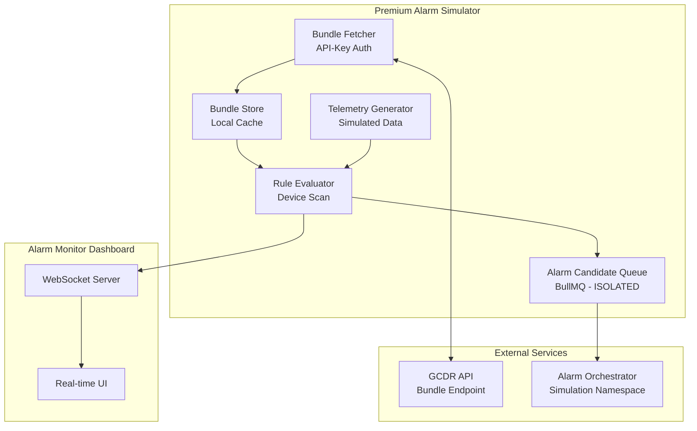

# RFC-0010: Premium Alarm Simulator

- **Status**: Implemented (MVP)
- **Created**: 2026-01-23
- **Updated**: 2026-02-05
- **Author**: GCDR Team
- **Review**: [RFC-0010-Premium-Alarm-Simulator.review.md](./RFC-0010-Premium-Alarm-Simulator.review.md)
- **User Manual**: [SIMULATOR-MANUAL.md](./SIMULATOR-MANUAL.md)
- **Enhancement**: [RFC-0014](./RFC-0014-FixSimulator-Implementation-Plan.md) — Scenario Builder wizard & 2×3 grid layout (Implemented)

## Summary

This RFC proposes a premium backend feature that provides a complete alarm simulation environment. The simulator emulates the behavior of a Central device interacting with the GCDR and Alarm Orchestrator systems, enabling developers and operators to test, validate, and demonstrate the entire alarm workflow without physical hardware.

## Motivation

Testing the complete alarm pipeline from device telemetry to alarm creation currently requires:
- Physical Central devices with proper configuration
- Real devices generating telemetry data
- Network connectivity to all backend services

This creates barriers for:
- **Development**: Developers cannot easily test alarm rules without hardware
- **QA**: Quality assurance requires complex test environments
- **Sales Demos**: Demonstrating alarm capabilities requires real equipment
- **Training**: Onboarding new team members requires access to physical infrastructure

A premium simulator feature addresses these challenges by providing a software-based simulation of the entire alarm workflow.

## Guide-level Explanation

The Premium Alarm Simulator consists of four main components:

### 1. Bundle Fetcher (Central Simulation)

Simulates a Central device that:
- Authenticates using Customer API Key with `simulator:read` scope
- Fetches the alarm rules bundle from the GCDR backend
- Validates bundle signature and version
- Stores the bundle locally for rule evaluation

### 2. Bundle Refresh Loop

Runs continuously to:
- Check for bundle updates every 5 minutes (configurable, minimum 60s)
- Compare local bundle signature/version with remote
- Download new bundle when changes are detected
- Log all bundle operations for observability

### 3. Device Scanner & Rule Evaluator

Simulates the Central's device monitoring:
- Scans configured devices periodically (minimum 30s interval)
- Generates simulated telemetry data
- Evaluates alarm rules against telemetry (uses same logic as production)
- Triggers `AlarmCandidateRaised` events when rules match
- Sends events to **dedicated simulation queue** (isolated from production)

### 4. Alarm Monitor Dashboard

Provides real-time visibility into:
- Active simulations
- Bundle status (version, last fetch, signature)
- Device scan activity
- Alarm candidates generated
- Alarm creation confirmations

## Reference-level Explanation

### Architecture Overview



### Data Isolation Strategy

**CRITICAL**: Simulated data MUST be isolated from production data.

#### 1. Event Tagging

All simulated events include explicit identification:

```typescript
interface AlarmCandidateRaised {
  source: {
    type: 'SIMULATOR';  // Always 'SIMULATOR' for simulated events
    simulationId: string;
    // ...
  };
  metadata: {
    simulated: true;  // Explicit flag
    // ...
  };
}
```

#### 2. Queue Isolation

Simulated events go to a **separate BullMQ queue**:

| Queue | Purpose |
|-------|---------|
| `alarm-candidates` | Production alarms only |
| `alarm-candidates:simulated` | Simulated alarms only |

```typescript
// Production queue
const productionQueue = new Queue('alarm-candidates', { connection: redis });

// Simulation queue (isolated)
const simulationQueue = new Queue('alarm-candidates:simulated', { connection: redis });
```

#### 3. Database Isolation

Simulator data in separate tables (`simulator_sessions`, `simulator_events`) with automatic cleanup.

### Rate Limiting and Quotas

To prevent abuse and resource exhaustion:

| Limit | Default | Premium Override |
|-------|---------|------------------|
| Max concurrent sessions per tenant | 3 | 10 |
| Min scan interval | 30 seconds | 10 seconds |
| Min bundle refresh interval | 60 seconds | 30 seconds |
| Max devices per session | 50 | 200 |
| Max scans per hour | 1,000 | 10,000 |
| Session auto-expire | 24 hours | 72 hours |

#### Rate Limit Implementation

```typescript
interface SimulatorQuotas {
  maxConcurrentSessions: number;
  minScanIntervalMs: number;
  minBundleRefreshIntervalMs: number;
  maxDevicesPerSession: number;
  maxScansPerHour: number;
  sessionExpireHours: number;
}

const DEFAULT_QUOTAS: SimulatorQuotas = {
  maxConcurrentSessions: 3,
  minScanIntervalMs: 30_000,
  minBundleRefreshIntervalMs: 60_000,
  maxDevicesPerSession: 50,
  maxScansPerHour: 1_000,
  sessionExpireHours: 24,
};

const PREMIUM_QUOTAS: SimulatorQuotas = {
  maxConcurrentSessions: 10,
  minScanIntervalMs: 10_000,
  minBundleRefreshIntervalMs: 30_000,
  maxDevicesPerSession: 200,
  maxScansPerHour: 10_000,
  sessionExpireHours: 72,
};
```

### Authentication and Authorization

#### API Key Scopes

New scopes for simulator access:

| Scope | Description |
|-------|-------------|
| `simulator:read` | Fetch bundles for simulation |
| `simulator:write` | Start/stop simulations |
| `simulator:admin` | Manage all tenant simulations |

#### Endpoint Authorization

```typescript
// Control endpoints require JWT + simulator:write scope
app.post('/simulator/start',
  authMiddleware,
  requireScope('simulator:write'),
  startSimulationHandler
);

// Bundle fetch accepts API Key with simulator:read
app.get('/simulator/bundle',
  apiKeyMiddleware('simulator:read'),
  getSimulatorBundleHandler
);

// WebSocket requires valid session ownership
app.ws('/simulator/monitor/:sessionId',
  authMiddleware,
  validateSessionOwnership,
  monitorHandler
);
```

#### API Key Rotation Policy

- Simulator API keys should have expiration (max 90 days)
- Audit log all simulator API key usage
- Alert on unusual patterns (>10 sessions, >5000 scans/hour)

### API Endpoints

#### 1. Start Simulation

```http
POST /api/v1/simulator/start
Content-Type: application/json
Authorization: Bearer {token}
X-Tenant-Id: {tenant_id}

{
  "name": "QA Test Session",
  "bundleRefreshIntervalMs": 300000,
  "deviceScanIntervalMs": 60000,
  "devices": [
    {
      "deviceId": "device-uuid",
      "telemetryProfile": {
        "temperature": { "min": 20, "max": 40, "unit": "celsius" },
        "humidity": { "min": 30, "max": 80, "unit": "percent" }
      }
    }
  ]
}
```

**Response:**
```json
{
  "success": true,
  "data": {
    "simulationId": "sim-uuid",
    "status": "RUNNING",
    "startedAt": "2026-01-27T10:00:00Z",
    "expiresAt": "2026-01-28T10:00:00Z",
    "quotas": {
      "scansRemaining": 1000,
      "sessionExpiresIn": 86400
    }
  }
}
```

#### 2. Stop Simulation

```http
POST /api/v1/simulator/stop
Content-Type: application/json
Authorization: Bearer {token}

{
  "simulationId": "sim-uuid"
}
```

#### 3. Get Simulation Status

```http
GET /api/v1/simulator/status/{simulationId}
Authorization: Bearer {token}
```

**Response:**
```json
{
  "success": true,
  "data": {
    "simulationId": "sim-uuid",
    "status": "RUNNING",
    "startedAt": "2026-01-27T10:00:00Z",
    "expiresAt": "2026-01-28T10:00:00Z",
    "bundle": {
      "version": "1.0.0",
      "signature": "sha256:abc123...",
      "lastFetchedAt": "2026-01-27T10:05:00Z",
      "rulesCount": 15
    },
    "stats": {
      "deviceScans": 50,
      "alarmsTriggered": 3,
      "lastScanAt": "2026-01-27T10:04:30Z",
      "scansRemaining": 950
    }
  }
}
```

#### 4. List Active Simulations

```http
GET /api/v1/simulator/sessions
Authorization: Bearer {token}
X-Tenant-Id: {tenant_id}
```

#### 5. Simulator Bundle Fetch

```http
GET /api/v1/simulator/bundle
X-API-Key: {simulator_api_key}
X-Tenant-Id: {tenant_id}
X-Simulation-Id: {simulation_id}
```

### AlarmCandidateRaised Event Schema

Following the Alarm Orchestrator specification with simulation markers:

```typescript
interface AlarmCandidateRaised {
  // Identification
  fingerprint: string;          // SHA256 hash for deduplication
  tenantId: string;
  customerId: string;

  // Source - MUST identify as simulator
  source: {
    type: 'SIMULATOR';          // Always 'SIMULATOR'
    simulationId: string;       // Session ID
    deviceId: string;
    deviceIdentifier: string;
    centralId: string;
  };

  // Rule that triggered
  rule: {
    id: string;
    name: string;
    severity: 'INFO' | 'WARNING' | 'CRITICAL';
  };

  // Telemetry snapshot
  telemetry: {
    field: string;
    value: number;
    threshold: number;
    operator: string;
    timestamp: string;
  };

  // Metadata - MUST include simulated flag
  metadata: {
    simulated: true;            // Always true
    simulatedAt: string;
    bundleVersion: string;
    sessionName: string;
  };
}
```

### WebSocket Events

```
WS /api/v1/simulator/monitor/{simulationId}
Authorization: Bearer {token}
```

**Event Types:**

| Event | Description |
|-------|-------------|
| `BUNDLE_FETCHED` | New bundle downloaded |
| `BUNDLE_UNCHANGED` | Bundle check - no changes |
| `DEVICE_SCANNED` | Device telemetry generated |
| `RULE_EVALUATED` | Rule checked against telemetry |
| `ALARM_CANDIDATE_RAISED` | Alarm condition met |
| `ALARM_CREATED` | Alarm confirmed by orchestrator |
| `QUOTA_WARNING` | Approaching rate limit |
| `SESSION_EXPIRING` | Session will expire soon |

### Database Schema

```sql
-- Simulator Sessions
CREATE TABLE simulator_sessions (
  id UUID PRIMARY KEY DEFAULT gen_random_uuid(),
  tenant_id UUID NOT NULL,
  customer_id UUID NOT NULL,
  created_by UUID NOT NULL,

  name VARCHAR(100) NOT NULL,
  status VARCHAR(20) NOT NULL DEFAULT 'PENDING',

  -- Configuration
  config JSONB NOT NULL,

  -- Quotas tracking
  scans_count INTEGER DEFAULT 0,
  scans_limit INTEGER NOT NULL,

  -- Bundle state
  bundle_version VARCHAR(50),
  bundle_signature VARCHAR(128),
  bundle_fetched_at TIMESTAMPTZ,

  -- Statistics
  alarms_triggered_count INTEGER DEFAULT 0,
  last_scan_at TIMESTAMPTZ,

  -- Lifecycle
  started_at TIMESTAMPTZ,
  expires_at TIMESTAMPTZ NOT NULL,
  stopped_at TIMESTAMPTZ,
  created_at TIMESTAMPTZ NOT NULL DEFAULT NOW(),
  updated_at TIMESTAMPTZ NOT NULL DEFAULT NOW(),

  CONSTRAINT valid_status CHECK (status IN ('PENDING', 'RUNNING', 'STOPPED', 'EXPIRED', 'ERROR'))
);

-- Simulator Events (for audit/replay)
CREATE TABLE simulator_events (
  id UUID PRIMARY KEY DEFAULT gen_random_uuid(),
  session_id UUID NOT NULL REFERENCES simulator_sessions(id) ON DELETE CASCADE,

  event_type VARCHAR(50) NOT NULL,
  event_data JSONB NOT NULL,

  created_at TIMESTAMPTZ NOT NULL DEFAULT NOW()
);

-- Indexes
CREATE INDEX idx_sim_sessions_tenant ON simulator_sessions(tenant_id);
CREATE INDEX idx_sim_sessions_status ON simulator_sessions(status) WHERE status = 'RUNNING';
CREATE INDEX idx_sim_sessions_expires ON simulator_sessions(expires_at) WHERE status = 'RUNNING';
CREATE INDEX idx_sim_events_session ON simulator_events(session_id);
CREATE INDEX idx_sim_events_created ON simulator_events(created_at);

-- Auto-cleanup: partition by month for easy retention management
-- Events older than 30 days can be dropped by dropping partition
```

### State Recovery Strategy

On service restart, recover active sessions:

```typescript
class SimulatorService {
  async initialize(): Promise<void> {
    // 1. Load running sessions from database
    const activeSessions = await this.sessionRepository.findByStatus('RUNNING');

    // 2. Check for expired sessions
    const now = new Date();
    for (const session of activeSessions) {
      if (session.expiresAt < now) {
        await this.markExpired(session.id);
        continue;
      }

      // 3. Restore session to memory
      await this.restoreSession(session);
    }

    logger.info(`Restored ${this.activeSessions.size} simulator sessions`);
  }

  private async restoreSession(session: SimulatorSession): Promise<void> {
    // Fetch fresh bundle
    const bundle = await this.bundleService.fetchBundle(session.config);

    // Resume loops
    session.startBundleRefreshLoop(/* ... */);
    session.startDeviceScanLoop(/* ... */);

    this.activeSessions.set(session.id, session);
  }
}
```

### Cleanup Policy

Automatic cleanup via scheduled job:

```typescript
// Run every hour
@Cron('0 * * * *')
async cleanupExpiredSessions(): Promise<void> {
  // 1. Mark expired sessions
  await this.sessionRepository.markExpiredSessions();

  // 2. Stop any still-running expired sessions
  for (const [id, session] of this.activeSessions) {
    if (session.expiresAt < new Date()) {
      await this.stopSimulation(id);
    }
  }

  // 3. Delete old events (>30 days)
  await this.eventRepository.deleteOlderThan(30);

  // 4. Delete old sessions (>90 days)
  await this.sessionRepository.deleteOlderThan(90);
}
```

### Observability

#### Metrics (Prometheus)

```typescript
// Counters
simulator_sessions_total{tenant_id, status}
simulator_scans_total{tenant_id, session_id}
simulator_alarms_triggered_total{tenant_id, session_id, severity}
simulator_bundle_fetches_total{tenant_id, result}

// Gauges
simulator_active_sessions{tenant_id}
simulator_quota_remaining{tenant_id, session_id}

// Histograms
simulator_scan_duration_seconds{tenant_id}
simulator_bundle_fetch_duration_seconds{tenant_id}
simulator_rule_evaluation_duration_seconds{tenant_id}
```

#### Structured Logging

```typescript
logger.info('Simulation started', {
  event: 'SIMULATOR_SESSION_STARTED',
  tenantId,
  sessionId,
  userId: createdBy,
  config: { deviceCount, scanInterval, refreshInterval }
});

logger.info('Alarm candidate raised', {
  event: 'SIMULATOR_ALARM_CANDIDATE',
  tenantId,
  sessionId,
  deviceId,
  ruleId,
  severity,
  value,
  threshold
});
```

#### Audit Integration

All simulator actions logged via RFC-0009 audit system:

| Action | Entity Type | Description |
|--------|-------------|-------------|
| CREATE | SIMULATOR_SESSION | Session started |
| UPDATE | SIMULATOR_SESSION | Config changed |
| DELETE | SIMULATOR_SESSION | Session stopped |
| READ | SIMULATOR_BUNDLE | Bundle fetched |

## Drawbacks

1. **Resource Consumption**: Running multiple simulations with high-frequency scanning can consume significant server resources. *Mitigated by rate limits and quotas.*

2. **Data Pollution**: Simulated alarms may mix with real alarms. *Mitigated by queue isolation and explicit tagging.*

3. **Complexity**: Adds significant complexity to the codebase. *Justified by value for dev/QA/demo/training.*

4. **Maintenance Burden**: The simulator must be kept in sync with changes to the alarm system. *Mitigated by using same rule evaluation logic.*

## Rationale and Alternatives

### Why this approach?

1. **Full Pipeline Testing**: Unlike unit tests, this approach tests the entire alarm pipeline end-to-end.

2. **Realistic Simulation**: By emulating Central behavior, we catch integration issues that isolated tests miss.

3. **Premium Feature**: Positioning as premium limits resource usage to paying customers who need this capability.

### Alternatives Considered

1. **Mock Mode in Alarm Orchestrator**: Add a mock mode directly in the orchestrator.
   - Rejected: Doesn't test GCDR integration or bundle fetching.

2. **Separate Simulation Service**: Build as a completely separate microservice.
   - Rejected: Increases deployment complexity and maintenance burden.

3. **Test Data Generators**: Provide scripts to generate test data.
   - Rejected: Doesn't provide real-time simulation or monitoring capabilities.

## Implementation Checklist

### Phase 1: Core Infrastructure ✅
- [x] Create `simulator_sessions` table schema
- [x] Create `simulator_events` table schema
- [x] Implement `SimulatorSession` entity
- [x] Implement `SimulatorEvent` entity
- [x] Create Drizzle migrations
- [x] Add `simulator:read`, `simulator:write`, `simulator:admin` scopes

### Phase 2: Rate Limiting & Quotas ✅
- [x] Implement `SimulatorQuotas` configuration
- [x] Add quota checking (`SimulatorQuotaService`)
- [x] Implement scans counter per session
- [x] Add session expiration logic
- [x] Implement cleanup job (`cleanupOldSimulatorData`)

### Phase 3: Bundle Fetcher ✅
- [x] Implement bundle fetch service (`SimulatorBundleFetcher`)
- [x] Implement bundle caching
- [x] Implement bundle change detection
- [x] Add event logging for bundle fetches

### Phase 4: Simulation Engine ✅
- [x] Implement `SimulatorEngine`
- [x] Implement bundle refresh loop with min interval check
- [x] Implement device scan loop with rate limiting
- [x] Implement telemetry generator
- [x] Implement rule evaluator
- [x] Implement alarm candidate creation with simulation markers

### Phase 5: Queue Isolation ✅
- [x] Create in-memory queue `alarm-candidates:simulated` (MVP)
- [x] Implement queue routing via `SimulatorQueueService`
- [ ] Future: Migrate to BullMQ for production

### Phase 6: Control Endpoints ✅
- [x] Implement `POST /simulator/start`
- [x] Implement `POST /simulator/:sessionId/stop`
- [x] Implement `GET /simulator/:sessionId`
- [x] Implement `GET /simulator/sessions`
- [x] Implement `GET /simulator/:sessionId/events`
- [x] Implement `GET /simulator/quotas`
- [x] Add input validation (Zod schemas)
- [x] Add authorization checks

### Phase 7: State Recovery ✅
- [x] Implement session recovery on startup (`initializeSimulator`)
- [x] Add graceful shutdown (`shutdownSimulator`)
- [x] Register shutdown handlers

### Phase 8: Alarm Monitor (SSE) ✅
- [x] Implement SSE endpoint (`GET /simulator/:sessionId/monitor`)
- [x] Implement real-time event broadcasting
- [x] Implement session ownership validation
- [x] Add connection management
- [ ] Future: Migrate to WebSocket if needed

### Phase 9: Observability ✅
- [x] Add metrics service (`SimulatorMetrics`)
- [x] Add structured logging
- [x] Implement health check endpoint
- [ ] Future: Add Prometheus/CloudWatch integration
- [ ] Future: Create Grafana dashboard template

### Phase 10: Testing & Documentation 🔄
- [ ] Unit tests for SimulatorService
- [ ] Integration tests for API endpoints
- [ ] SSE connection tests
- [ ] Rate limiting tests
- [ ] Update OpenAPI/Swagger documentation
- [ ] Create user guide for simulator feature

## Approval Conditions

Per review feedback, the following MUST be completed before Phase 4:

- [x] Define data isolation strategy (queue separation + tagging)
- [x] Define rate limits and quotas
- [x] Specify authentication/authorization model
- [x] Define state recovery strategy
- [x] Define cleanup policy
- [x] Add observability requirements
- [x] Fix architecture diagram (Mermaid)
