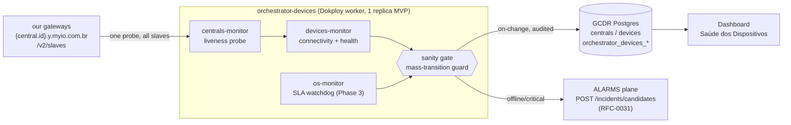
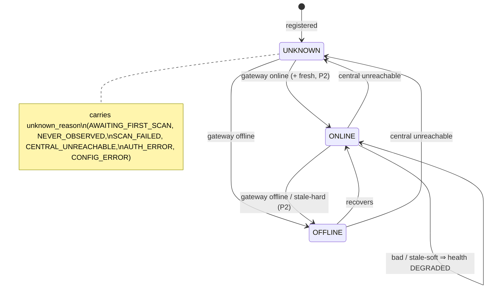

# RFC-0062 — Orchestrator-Devices: Centrals, Devices & Work-Order Monitoring Service

- **Feature Name:** `orchestrator_devices`
- **Start Date:** 2026-08-31
- **Status:** Draft **v2** (rewritten 2026-08-31 after a six-lens review round + operational-owner decisions)
- **Authors:** GCDR Core Team
- **Domain:** Centrals / Devices / Work Orders / Operational monitoring / Incidents
- **Deployment target:** a dedicated **Dokploy container** (a headless worker, not the API), sharing the GCDR image and database
- **Related:** RFC-0009 (Events & Audit Logs), RFC-0055 (No-Consumption Incidents), RFC-0030/0031 (Alarms: No-Consumption evaluator + Multi-Source Incident Ingestion), RFC-0023 (Device Identity — connectivity ownership), RFC-0060 (audit vs. operational-log separation), gcdr PR #19 (Central topology / connectivity reconcile), the **Alarm Orchestrator** (`gh-myio/alarms-backend` — the orchestrator/dispatcher/verify worker pattern this RFC mirrors).

> **What changed in v2.** The v1 draft tried to ship three monitors as one thing, sold `2xx == ONLINE` as truth, proposed a hard single-writer cutover, and left "emit incidents in ALARMS" as a generic phrase. v2 responds to a full review round: it **slices the MVP** (gateway **and** devices connectivity, not health/telemetry), replaces the **hard cutover with shadow-mode + rollback flags**, makes **`UNKNOWN` an explainable state** (`unknown_reason`), **stops treating a 2xx as health truth**, adds a **sanity gate** against mass-transition writes, and — the big one — turns the ALARMS integration into a **hard incident contract** (kinds, dedupe keys, lifecycle, cascade suppression). Advisory-lock leadership is retained but explicitly scoped to a **single-replica MVP** (no external pooler confirmed; HA is a non-goal for v1).

> **Implementation status (living — Phase 1 in progress on `feat/rfc-0062-orchestrator-devices`).**
> - ✅ **Batch 1 — runtime skeleton (write-safe).** Migration `0070` (additive columns + `orchestrator_devices_{control,runs,checks}` + retry/freshness policy books, all seeded SAFE: MASTER off, shadow on, canonical/incident off) + Drizzle schema; `reserveConnection()` (db.ts); worker entrypoint (scheduler, top-down gates, heartbeat, no-overlap, graceful shutdown); per-monitor advisory lock on a reserved connection (§1); `/v2/slaves` client with tolerant Zod + retry book + error taxonomy (§4/§5). Writes nothing canonical.
> - ✅ **Batch 2 — monitors in shadow (write-safe).** The Phase-1 device connectivity rides the centrals sweep (one `/v2/slaves` probe reconciles the central + all its slaves, no fan-out). `centralsMonitor.ts`: probe under the retry book → **evidence always written** (`last_gateway_check_*`, `probe_result`) → central + per-device status classified via the deterministic `ladder.ts` and recorded to the shadow ledger (`proposed_write` + `unknown_reason`); cascade suppression (central down ⇒ devices `CENTRAL_UNREACHABLE`, no device down-flip). `sanityGate.ts` computes the fleet-wide mass-transition guard.
> - ✅ **Batch 3 — canonical apply behind the flag (item 7).** `canonicalApply.ts`: three guards (`!shadow_mode ∧ canonical_writes_enabled ∧ !sanity.held`), only-on-change batched updates, audited (RFC-0009) **only on real transitions** with a `SYSTEM` actor and old→new. Audit granularity mirrors incident cascade-suppression: a central going down is ONE audited event carrying the affected-device count, not N per-device rows. Rollback is a flag flip (`shadow_mode=true` or `canonical_writes_enabled=false`). Unit tests cover the three guards, only-on-change, audit-only-on-transition, cascade audit suppression, and the ladder rows. **Validated by a local canonical dry-run** (central ONLINE→OFFLINE + 307 devices→CENTRAL_UNREACHABLE, 1 audit row; rollback flip proven to block the write). Ships still OFF by seed (shadow on).
> - ✅ **Batch 4 — incident emission (item 8).** `incidents.ts`: **CENTRAL_OFFLINE + DEVICE_OFFLINE only** (DEVICE_DEGRADED deferred). Dedupe key omits `day` (continuous state); **debounce** derived from the last N `orchestrator_devices_checks` for the entity (insufficient history ⇒ never opens — a first bad tick can't become an incident); emission behind `incident_emission_enabled` (absent `ALARMS_API_URL` ⇒ dry-run/log, no POST); a POST failure is swallowed (never fails the sweep); payload is RFC-0031 `mode=PARTIAL`; the ALARMS token is never logged. Guardrails enforced: `CENTRAL_UNREACHABLE` devices are UNKNOWN so never DEVICE_OFFLINE; AUTH_ERROR/CONFIG_ERROR never CENTRAL_OFFLINE; sanity held blocks emission too. Unit-tested (dedupe, payload, debounce, emit gate/dry-run/failure-never-throws/no-token-in-logs). Ships OFF by seed.
> - ✅ **Batch 5 — operability (deploy shell).** `docker-compose.dokploy.yml` (worker sibling: same image, `command: node dist/workers/orchestrator-devices.worker.js`, single replica, no public port, `restart: on-failure`, DB healthcheck via `last_run_at` freshness — `orchestrator-devices.healthcheck.js`); `.env.dokploy.orchestrator-devices` (safety flags note + intervals/timeouts/retry + optional ALARMS + tunnel + healthcheck; secrets via Dokploy, not committed); `docs/ops/RFC-0062-orchestrator-devices-runbook.md` (apply migration → boot safe → enable a gateway → shadow → inspect → smoke online/offline → cutover criteria → immediate rollback → enable incidents after validating ALARMS → revert to safe). Boots SAFE by the 0070 seed regardless of env.
> - ✅ **Batch 6 — PR #54 review fixes.** Canonical writes now bump `updatedAt` (centrals + devices) and stamp `last_connected_at`/`last_disconnected_at` on the connectivity edge (mirrors `DeviceRepository`); ledger retention (`ORCH_DEVICES_LEDGER_RETENTION_DAYS`, default 7) prunes `_checks`/`_runs` each sweep; device selection filters `status='ACTIVE'`; a non-auth 4xx probe is `CONFIG_ERROR` (deterministic, no retry) not `HTTP_5XX`; ALARMS base must include `/api/v1`; PR #19 interim-baseline flag is documented **default off**. +2 test suites (gateway classification, connectivity edges).
> - ⬜ **Pending.** cockpit (Phase 2) → telemetry fan-out (Phase 2) → os-monitor (Phase 3). Real `/incidents/candidates` integration is a separate smoke once `ALARMS_API_URL`/token are pointed. Phase 1 is operable end-to-end (PR #54 → `desenv`).

---

## Summary

Introduce **`orchestrator-devices`**, a headless GCDR **worker service** — its own Dokploy container from the GCDR image — that continuously **observes the operational state of centrals, devices, and work orders**, reconciles that state into GCDR **off the request path**, and — when a device or central goes down — **raises an actionable incident in the ALARMS plane**. The API records *who exists*; this service tracks *what is currently happening to it* (online/offline, healthy/degraded, on-time/overdue) and both writes it back as first-class state **and** hands support an incident to act on.

It follows the proven shape of the **Alarm Orchestrator** (`orchestrator` / `dispatcher` / `verify` workers, one image, per-role container): here the roles are **centrals-monitor**, **devices-monitor**, **os-monitor**, and — extending the service from *liveness* to *rule orchestration* — **rules-monitor**, which keeps `NO_CONSUMPTION` rule membership honest by auto-muting a device that has hit its daily incident cap and restoring it at the local-day rollover (§11b).

The nominal human in the loop is **support / atendimento**: they see an `OFFLINE`/`CRITICAL` incident, attempt a remote action (recheck, pause monitoring) from a panel, and dispatch a local team when needed.

## Motivation

Four concrete gaps show GCDR has no operational-monitoring plane today:

- **M1 — Device connectivity is almost entirely `UNKNOWN`.** The dashboard reports **1771 of 1788 devices as "Desconhecido"** because `devices.connectivity_status` is never populated for most devices. No service derives connectivity from the central link and writes it back.
- **M2 — Device health status is a mock.** `DashboardService` returns `health: { …, unknown: total }` with a note that health is not yet tracked. No health-check service exists.
- **M3 — Reconcile is smuggled onto a read.** PR #19's `CentralTopologyService.getTopology` reconciles `central.connection_status` and each device's `connectivity_status` **as a side effect of a `GET`** — breaking GET idempotency and making global counts depend on someone opening a topology page.
- **M4 — Work orders have no SLA watchdog.** OS lifecycle carries SLA/escalation semantics, but nothing scans open OSs for overdue/breached/stale states.

> **Note on M1 root cause (open — see Unresolved Q1).** v2 does **not** assume "UNKNOWN because no probe ever ran" without proof. If the true cause is "ingestion should populate it and fails", part of the fix is upstream. The shadow-mode phase (§9) is designed to surface this before any canonical write.

---

## Glossary & core states

Define the vocabulary **before** it is used in prose. The domain has three nested nouns and two state axes that are easy to conflate.

**Entities**

| Term | What it is | Identity |
|---|---|---|
| **Central** (a.k.a. **gateway**) | The field hardware that bridges a site's devices to the cloud. Reachable at a tunnel host keyed by its UUID. | `central.id` = hardware UUID; `serial_number` = logical Central ID (RFC-0005). |
| **Slave** | A device **as the central's firmware names it** on the RF/RS-485 bus. The `/v2/slaves` payload is a list of these. | `slave.id` (int), unique within a central. |
| **Device** | The **GCDR business entity** for a slave. A slave maps to a device. | joined by `(central_id, slave_id)` (channel-centric identity, migration 0029). |

> `slaves` is an **endpoint name and a firmware noun**; `device` is the **business entity**. They are the same physical thing seen from two sides — do not read them as different objects.

**Connectivity state** (`devices.connectivity_status`, `centrals.connection_status`)

| State | Meaning | Entered when | Left when |
|---|---|---|---|
| `ONLINE` | Observed and reporting | gateway reports it up **and** (Phase 2) telemetry is fresh | goes offline / stale / central unreachable |
| `OFFLINE` | Observed and down | gateway reports `offline`, or (Phase 2) telemetry stale past hard limit | recovers |
| `UNKNOWN` | **Not observed** — never silently healthy | see `unknown_reason` | first successful observation |

**`unknown_reason`** (new column — makes `UNKNOWN` explainable instead of a grey pool)

| Reason | Meaning | Operator read |
|---|---|---|
| `AWAITING_FIRST_SCAN` | Monitor just started; not yet swept | transient — "warming up" |
| `NEVER_OBSERVED` | Registered but never reported | **data/commissioning** issue, not connectivity |
| `SCAN_FAILED` | Should be observable, scan errored | needs attention |
| `CENTRAL_UNREACHABLE` | Parent central is OFFLINE → device unobservable | **suppressed** (root cause is the central, §8) |
| `AUTH_ERROR` | Probe got 401/403 — our credential, not the device | fix the monitor's credential |
| `CONFIG_ERROR` | e.g. NXDOMAIN / bad tunnel host | fix config, not a real outage |

**Health state** (`devices.health_status`, new column) — `HEALTHY | DEGRADED | CRITICAL | UNKNOWN`, resolved by the precedence ladder in §6.

---

## Guide-level explanation

`orchestrator-devices` is **one process with three monitors**, each a scheduled loop. It holds no user session, authenticates to our own gateways with a service credential, writes to the GCDR DB directly, and emits incident candidates to the ALARMS plane.



- **Deploys like the Alarm Orchestrator.** Same GCDR image; the container `command` is `node dist/workers/orchestrator-devices.worker.js`; a `.env.dokploy.orchestrator-devices` sets intervals/thresholds and the shared `DATABASE_URL`. It serves **no HTTP** — liveness is a **DB heartbeat healthcheck** (`orchestrator-devices.healthcheck.js`, checking `MASTER.last_run_at` freshness), not an HTTP endpoint (§1).
- **Off the request path.** Nothing in the API mutates connectivity/health anymore; the API only reads. PR #19's `GET` reconcile is put behind a flag and retired after shadow-mode validates the new writer (§9).
- **GCDR decides, ALARMS dispatches.** The worker computes offline/degraded and pushes an incident candidate; ALARMS owns persistence, lifecycle, and the panel — exactly the split RFC-0055 already uses.

For an operator: the dashboard's "Saúde dos Dispositivos" stops reading "1% online / 1771 desconhecido" and starts reflecting reality — and every real outage becomes a support incident, not a silent grey cell.

---

## Scope & phasing (the MVP is gateway **and** devices, not health/telemetry)

The end state is three monitors; this is **not** one implementation. Each phase is independently deployable. **Only Phase 1 is in scope for the first implementation PR.**

| Phase | Scope | Fixes | Notes |
|---|---|---|---|
| **1 — MVP (required)** | `centrals-monitor` liveness (§3–§5) **+** `devices-monitor` **connectivity** from the same `/v2/slaves` payload (§6 Phase 1) **+ reduced health** (connectivity + gateway `status`, no telemetry) **+ ALARMS incidents** for `CENTRAL_OFFLINE`/`DEVICE_OFFLINE` (§8) **+ cascade suppression** (§8) **+ shadow-mode → guarded cutover** (§9) **+ rollback flags** (§10). Single replica; advisory lock as anti-double-deploy insurance. | **M1, M3, partial M2** | Fixes the headline `UNKNOWN` gap **and** removes the GET-that-mutates, with an actionable incident, **without** the expensive/unvalidated telemetry fan-out. |
| **2 — Telemetry + cockpit** | Per-slave telemetry pull (§6 Phase 2) → **full freshness gate + full health ladder + water 72h rule**, under a bounded tick budget. **+ Admin cockpit** `/admin/orchestrator-devices` (§12). | **full M2** | The freshness thresholds (24h/72h) are validated in shadow during Phase 1/2 before they gate anything real. |
| **3 — OS SLA** | `os-monitor` (§11): overdue / SLA-breach / stale + escalation. | **M4** | **Contract-blocked** — WO SLA data model must be pinned first (§11). |
| **4 — Rules orchestration** | `rules-monitor` (§11b): **NO_CONSUMPTION** daily-limit **auto-mute / restore** — read ALARMS per-day incident counts, remove a device from the rule when it hits its daily cap, re-add it at the local-day rollover. | new | Reads ALARMS (first read dependency); physical `scope_entity_ids` edit + durable restore ledger; shadow-first; NO_CONSUMPTION only (other rule types deferred). |

Rationale: liveness + connectivity is cheap and idempotent (one call reconciles a central and all its slaves); the telemetry fan-out has a **qualitatively different load/failure profile** (per-slave, per-domain) and its freshness rules are business hypotheses; OS SLA needs a state contract that does not exist yet. Bundling them makes the first PR un-reviewable.

---

## Reference-level explanation

### 1. Deployment & runtime shape

- **Worker entrypoint** `src/workers/orchestrator-devices.worker.ts` → `dist/workers/`. `package.json` gains `worker:orchestrator-devices`.
- **Replicas — MVP runs one.** Confirmed: there is **no PgBouncer/pooler** between the GCDR app and Postgres (direct `postgres:5432`; the app uses postgres-js' in-process pool). The MVP Dokploy deploy runs **`replicas: 1`**, so **HA is an explicit non-goal for v1**. A single process with a "never overlap my own run" guard is sufficient for correctness.
- **Advisory lock as insurance, not architecture.** Each monitor scan takes a **session-level `pg_try_advisory_lock`** on a **dedicated (reserved) connection, per scan (acquire → run → release)** — *not* a pooled connection (a pooled lock binds to a socket that can be recycled and silently lost), and not held across scans (so a reserved socket is never pinned for the process lifetime). The codebase already reserves a socket for pinned work (`db.ts` `.reserve()` for `executeRawScript`); reuse that pattern. Advisory-lock keys are namespaced and **registered in a table in this doc** to avoid collisions. This protects only against an accidental second instance (e.g. a rolling deploy surge); it is **not** sold as HA.
- **Liveness of the worker itself.** The worker heartbeats `orchestrator_devices_control.last_run_at` every tick; an alert fires if it goes stale (**who watches the watchman** — a stalled worker must not fail silently, re-creating M2/M3).
- **Control hierarchy (three levels, all runtime-toggleable, all audited):**
  1. **MASTER switch** — one flag stops/starts the **entire** tick. Boot default `ORCH_DEVICES_MASTER_ENABLED`; live value in a `scope='MASTER'` row read at the top of every tick.
  2. **Per-monitor switch** — `centrals`/`devices`/`os`/`rules` individually.
  3. **Per-gateway switch** — `centrals.monitoring_enabled` (§3).
  A monitor runs only when **master ∧ monitor ∧ (gateway)** are all on. Every toggle is audited (§13).

### 2. Writer ownership — current writers → target (single-writer, specified)

The cutover (§9) makes this service the sole writer of the three status columns. Enumerated so it is a contract, not a slogan:

| Column | Current writer(s) | Target | Cutover action |
|---|---|---|---|
| `centrals.connection_status` | PR #19 topology GET reconcile | **`devices-monitor`** (see below) | Remove from GET (flag first, §9). |
| `devices.connectivity_status` | (a) PR #19 GET reconcile; (b) energy-ingestion on telemetry arrival (RFC-0023 Q4) | **`devices-monitor`** only | (a) removed with the GET; (b) **demoted to an input signal** — ingestion stops writing status; it may publish freshness this monitor *reads* (§6 Phase 2). |
| `devices.health_status` | *(none — column is new; today a mock)* | **`devices-monitor`** only | new additive column, written from the ladder (§6). |
| `centrals.last_heartbeat_at` | ingestion/heartbeat path | ingestion (**kept**) | input to liveness, not a status we own. |
| `rules.scope_entity_ids` (NO_CONSUMPTION) | human (UI/API) | human **+ `rules-monitor`** (auto-mute/restore, §11b) | `rules-monitor` may remove/re-add **only** devices it muted itself (tracked in the mute ledger); manual edits stay the human's — the two coexist via the ledger. |

> **Resolving the internal two-writer bug (review finding C1).** `centrals-monitor` and `devices-monitor` must **not** both write `centrals.connection_status`. Decision: **`devices-monitor` is the sole writer of `connection_status`** (the `/v2/slaves` payload it consumes already carries the gateway's up/down). `centrals-monitor` writes only its **own** probe-evidence fields (`last_gateway_check_at`, `last_gateway_check_latency_ms`, `probe_result`) — never the canonical status. One column, one writer.

### 3. Monitor A — `centrals-monitor` (per-gateway liveness probe)

- **Scope gate.** A central enters the routine only if `centrals.monitoring_enabled = true`; a disabled central is skipped entirely (and its devices with it). Roll out gateway-by-gateway.
- **Probe.** Each gateway is reachable at **our own** tunnel host (its UUID is the subdomain):
  ```
  GET https://{central.id}.y.myio.com.br/v2/slaves
  e.g. https://295628b1-75c6-4854-8031-107cd9a2ab91.y.myio.com.br/v2/slaves
  ```
  These endpoints are **ours**, so the probe is an internal health check, not an unconsented external dependency. Interpretation of the result is **layered** (§5) — a `2xx` is *not* by itself "healthy".
- **Interval — project default, per-gateway override.** Runs every `CENTRAL_CHECK_INTERVAL_SECONDS` (default **900 s / 15 min**); each central MAY override via `check_interval_seconds`. Each central is scheduled on its **own next-due time** with **jitter** (spread), so 1788 devices seeded at the same instant do not burst every 15 min (review finding: thundering herd).
- **Persisted (evidence only, not canonical status):** `last_gateway_check_at`, `last_gateway_check_latency_ms` (also trends degradation), `probe_result`. The **canonical** `connection_status` is written by `devices-monitor` from the same payload (§2).
- One tick renders a **sequence** like:

```mermaid
sequenceDiagram
  autonumber
  participant W as worker (tick)
  participant G as gateway /v2/slaves
  participant SG as sanity gate
  participant DB as GCDR DB
  participant AL as ALARMS
  W->>W: read MASTER ∧ monitor ∧ gateway gates
  W->>G: GET /v2/slaves (retry policy, §4)
  alt 2xx + valid payload
    G-->>W: [slaves…] (status per slave)
    W->>W: classify connectivity + reduced health (§6)
    W->>SG: proposed transitions
    SG->>SG: mass-transition check (§7)
    alt within bounds
      SG->>DB: write on-change (audited)
      SG->>AL: candidate for offline/critical (§8)
    else suspicious mass flip
      SG->>DB: HOLD canonical write; record anomaly
      SG->>AL: raise SUSPECTED_MASS_ANOMALY (human)
    end
  else timeout / 5xx / 401-403 / NXDOMAIN / parse-fail
    W->>DB: set unknown_reason (§5), evidence only
  end
```

### 4. Retry policy — the probe "policy book"

A single timeout is not proof a gateway is down. A probe runs under a **retry policy** before any `OFFLINE` verdict; a 2xx on any attempt ⇒ reachable.

- **A curated catalog** in `orchestrator_retry_policies (name, attempts jsonb, description)`. `attempts` is an ordered backoff list:

  | policy | backoff before each attempt | total |
  |---|---|---|
  | `strict` | `[0]` | 1 |
  | `default` | `[0, +5s, +15s]` | 3 |
  | `lenient` (flaky LTE/satellite) | `[0, +10s, +30s, +60s]` | 4 |

- **Per-gateway override + project default** via nullable `centrals.retry_policy` → env `CENTRAL_DEFAULT_RETRY_POLICY` (`default`).
- **Bounded** — a policy's total wall-time is capped at `CENTRAL_PROBE_MAX_TOTAL_MS`; all retries run inside the same tick.
- **Recorded** — `orchestrator_devices_checks` logs attempts, which succeeded, per-attempt latency, policy used.

This is the connectivity analogue of the alarm system's hysteresis/cooldown — a transient blip can't flap `connection_status`. **Incident** emission has its **own** debounce on top of this (§8) so a 2-minute blip is an event, not an incident.

### 5. The `/v2/slaves` contract — a 2xx is not truth

One probe feeds both monitors: a `200` returns a JSON array of ~199 slaves, so the same call proves the central is up **and** carries per-device state. But the result is interpreted in **four separate layers** — never collapsed into "2xx ⇒ healthy":

1. **Reached** — did the request get an HTTP response at all? (timeout / DNS / connection error ⇒ not reached.)
2. **Valid payload** — did it parse as the expected array? (a proxy returning `200 + HTML` ⇒ parse-fail, **not** reached-healthy.)
3. **Declared status** — what the gateway says per slave (`online`/`offline`/`bad`).
4. **Freshness** (Phase 2) — is the telemetry actually advancing?

**Error taxonomy → outcome** (each is distinct, none silently becomes `OFFLINE` or last-known):

| Probe outcome | Central | Device | `unknown_reason` |
|---|---|---|---|
| 2xx + valid | up | per §6 | — |
| timeout / connection refused (after retries) | `OFFLINE` | `UNKNOWN` | `CENTRAL_UNREACHABLE` (devices) |
| `401` / `403` | not a down verdict | `UNKNOWN` | `AUTH_ERROR` (our credential) |
| NXDOMAIN / bad host | not a down verdict | `UNKNOWN` | `CONFIG_ERROR` |
| `5xx` | treated as unreached (retry, then unknown) | `UNKNOWN` | `SCAN_FAILED` |
| 2xx + invalid body (parse-fail) | not a healthy verdict | `UNKNOWN` | `SCAN_FAILED` |

**Consumed defensively** (the firmware owns and versions this vocabulary):
- **Tolerant Zod** — required (`id`, `status`) validated; the rest optional/pass-through. A slave row failing required-field validation is **skipped + logged + counted**, never aborts the array.
- **Whitelist good states, don't blacklist bad ones.** `ONLINE` is granted **only** for `status == "online"` (and, Phase 2, fresh telemetry). An **unknown** `status` value is **not** treated as online — it falls to `UNKNOWN`, so a new failure code the firmware invents can never masquerade as healthy.
- **`offline` is authoritative-down; `online`/`bad` are candidates** (§6).
- **No implicit inventory writes** — a slave in the payload but absent in GCDR is *flagged* (unregistered), never auto-created; a slave in GCDR but absent from the payload is a "not seen" signal, never auto-deleted.
- **Version drift** — per-slave `version` is recorded; mixed-firmware fleets (v2 vs a future v3) are tolerated by a versioned client, not silent breakage.

**Payload shape (trimmed to what the monitors use):**
```jsonc
// GET https://{central.id}.y.myio.com.br/v2/slaves → 200, array
[
  { "id": 106, "type": "outlet", "name": "HIDR. …", "version": "6.0.0",
    "last_consumption": 0, "status": "online",
    "channels": [ { "id": 401, "type": "flow_sensor", "channel": 1, "value": 0 } ],
    "config": { "channelConfig": { /* channel0/1: type, pulses, output */ } } }
]
```

### 6. Monitor B — `devices-monitor`

Runs right after `centrals-monitor` confirms the gateway is reachable (they share the one `/v2/slaves` call).

**Phase 1 — connectivity (MVP, no fan-out).** The per-slave `status`, joined to devices by `(central_id, slave_id)`, drives `connectivity_status` — **asymmetrically**:
- **`offline` ⇒ genuinely `OFFLINE`.** The gateway asserts the slave is down; trust it, no freshness check needed.
- **`online` / `bad` ⇒ a *candidate*, not a verdict.** In Phase 1 (no telemetry pull), `online` ⇒ `ONLINE` and `bad` ⇒ `ONLINE`+`DEGRADED`. In Phase 2 the freshness gate can **downgrade** an `online` that is actually frozen to `OFFLINE` (see below).

**Reduced health ladder (Phase 1 — no telemetry rows).** `health_status` is resolved by a **fixed precedence ladder, first match wins**. Phase 1 uses the rows that need no telemetry pull; Phase 2 adds the freshness rows (marked ⧗).

| # | Condition (first match wins) | connectivity | health |
|---|---|---|---|
| 1 | central `monitoring_enabled=false`, or slave never observed | `UNKNOWN` (+reason) | `UNKNOWN` |
| 2 | parent central `OFFLINE` (probe failed) | `UNKNOWN` (`CENTRAL_UNREACHABLE`) | `UNKNOWN` |
| 3 | gateway `status = offline` | `OFFLINE` | `CRITICAL` |
| 4 ⧗ | telemetry stale past **hard** limit (Phase 2) | `OFFLINE` | `CRITICAL` |
| 5 | gateway `status = bad` | `ONLINE` | `DEGRADED` |
| 6 ⧗ | telemetry stale in the **soft** band (Phase 2) | `ONLINE` | `DEGRADED` |
| 7 | open alarm / active RFC-0055 no-consumption incident | `ONLINE` | `DEGRADED` |
| 8 | gateway `status = online` (Phase 1) / **and** fresh (Phase 2) / no alarms | `ONLINE` | `HEALTHY` |



The **8-line ladder is the source of truth and the test fixture** — table-driven, one case per row **plus** an explicit **default row** for any un-mapped input combination (default = `UNKNOWN`+`SCAN_FAILED`, never silently healthy). `DashboardService.devices.health` becomes a `GROUP BY health_status`.

**Phase 2 — telemetry pull + freshness (deferred, bounded).** For each slave the monitor pulls its last window per domain and persists the last real reading:

| domain | endpoint (on `https://{central.id}.y.myio.com.br`) | freshness mode |
|---|---|---|
| energy | `GET /consumption/slave/{id}/minute/{s}/{e}` | **arrival** |
| temperature | `GET /temperature_history/slave/{id}/{s}/{e}` | **arrival** |
| water/flow | `GET /flow/slave/{id}/{channel}/{s}/{e}` | **change** |

- **Persist:** `last_timestamp_telemetry`, `last_value_telemetry`, cursor `last_fetch_energy_telemetry` — **updated only when the window returned data**; an empty window advances the cursor but never clobbers the last real reading. **One slave-domain = one transaction** (cursor + status commit together, so defer never becomes silent skip).
- **Freshness gate (HYPOTHESIS, not contract).** Energy/temp: no arrival for `TELEMETRY_OFFLINE_AFTER` (default **24 h**) ⇒ `OFFLINE`. Water: no **change** in `reading` for `WATER_STALE_AFTER` (default **72 h**) ⇒ stuck-or-offline. **These numbers are unproven** — they are validated against real data in shadow (§9) before they gate anything. Per-slave override via a freshness policy book (`mode: arrival | change`).
- **Water edge cases (must be handled before calling anything CRITICAL):**
  - **Closed store** (no consumption over a weekend) ⇒ counter unchanged 72 h ⇒ **false positive**. "No change" ≠ "dead sensor" — cross-check with `activeHours`/known-idle before flagging.
  - **Meter reset/replacement** ⇒ counter drops; a decrease in a cumulative counter is a distinct event, not a normal change — classify explicitly, don't read it as "fresh".
  - **Comparison** uses integer/epsilon on `reading`, never exact float equality.
- **Tick budget** — per-central concurrency cap (`TELEMETRY_MAX_CONCURRENCY_PER_CENTRAL`, default 8), global cap (32), per-tick wall-time (`TELEMETRY_TICK_BUDGET_MS`). Slaves not reached are **deferred (cursor not advanced), never skipped**, pulled **least-recently-fetched first** (fairness — no tail starvation). Freshness is measured against **wall-clock age of the data**, so a deferred slave is never wrongly marked stale. The cap that matters is the **gateway's** tolerance, not the host's — *how many simultaneous connections a real gateway sustains is unmeasured* (Unresolved Q4).

> **Clock authority (freshness).** "24h/72h" is measured against a single authoritative clock. **Decision:** compare against the **server-side arrival/observation time**, not the gateway-supplied timestamp, so a drifting gateway clock cannot invert the gate. Gateway timestamps are recorded for evidence but are not the freshness reference.

### 7. Sanity gate — mass-transition circuit breaker

A firmware bug, a proxy fault, or a tunnel outage can make the gateway report a large slice of the fleet `offline` at once. The sanity gate prevents that from becoming a mass canonical write:

- If **> `SANITY_MAX_FLEET_FLIP_PCT`** (default 30%) of in-scope entities would transition to `OFFLINE`/`CRITICAL` in a single tick, the gate **holds the canonical write**, preserves last-known state, records a `SUSPECTED_MASS_ANOMALY`, and **raises it loudly to a human** (incident + audit).
- **It never swallows a real outage.** A genuine regional/ISP failure looks identical to a bug — so the gate does **not** silently drop it; it flags `held for review` and an operator confirms/releases. Holding-while-alerting, never quiet suppression.
- The gate is **per-scope**: a single central legitimately taking all its slaves offline is expected (that's cascade suppression, §8), not a fleet anomaly.

### 8. ALARMS Incidents — the hard contract

When a device or central goes down, the worker raises an **incident candidate** in the ALARMS plane via **`POST /incidents/candidates`** (Alarms RFC-0031's multi-source ingestion with atomic `ON CONFLICT` upsert). GCDR **decides + enriches**; ALARMS **persists + runs lifecycle + owns the panel** — the same split RFC-0055 already ships. This RFC is what makes **GCDR the first external producer** to that endpoint.

**Kinds, keys, severity** — note the **dedupe key omits `day`** (the crucial divergence from RFC-0055): no-consumption is a per-day evidence rollup, but **offline is a continuous state** — one incident open while the condition holds, spanning days.

| kind | dedupe key | default severity | opens when | auto-resolves when |
|---|---|---|---|---|
| `CENTRAL_OFFLINE` | `(tenant, customer, central, kind)` | `CRITICAL` | probe fails past debounce | central back ONLINE |
| `DEVICE_OFFLINE` | `(tenant, customer, device, kind)` | `HIGH` | device OFFLINE past debounce **and** parent central is up (not suppressed) | device back ONLINE |
| `DEVICE_DEGRADED` | `(tenant, customer, device, kind)` | `WARNING` | `bad` / stale-soft past debounce | device HEALTHY |

**Lifecycle** (reuses RFC-0055's model): status `OPEN | RESOLVED`; **ack is metadata** (`acknowledged_at/by/note`), not a status. **Auto-resolve on signal return**, plus an operator **manual-resolve escape hatch** ("this central was decommissioned"). One incident open per condition, updated idempotently by the upsert key.

**Cascade suppression — one root-cause incident, not 199.** This is the `unknown_reason` model applied:
- Central offline ⇒ **one** `CENTRAL_OFFLINE` incident.
- Devices behind it become `connectivity=UNKNOWN`, `unknown_reason=CENTRAL_UNREACHABLE`, `health=UNKNOWN` — **not** `OFFLINE`, and the devices-monitor **does not emit** `DEVICE_OFFLINE` for them while the parent is down.
- When the central recovers and devices are re-observed, a device that is *genuinely* still down then gets its own `DEVICE_OFFLINE`.
> The same new column (`unknown_reason=CENTRAL_UNREACHABLE`) fixes both the UX grey-pool problem **and** the incident-storm problem.

**Debounce (anti-flap).** An incident opens only after the down state **persists** beyond `INCIDENT_OPEN_AFTER` (default: 2 consecutive failed ticks / configurable minutes). A gateway that drops and returns in 2 minutes produces an **event in `orchestrator_devices_checks`, not an incident** — support is never paged for a blip.

**Producer authority.** GCDR-orchestrator-devices is the single writer of connectivity, so it is **conceptually authoritative for its own status columns** — but it **posts RFC-0031 candidates as `mode=PARTIAL`** (the conservative choice, until full central coverage is proven; the implementation uses PARTIAL). It does **not** touch `NO_CONSUMPTION` (that stays an Alarms-side producer). Revisit promoting these kinds to `AUTHORITATIVE` on the wire only once coverage guarantees are established.

**Enrichment.** GCDR provides the batch lookup (device name/slaveId, central name, customer name) so incident payloads and the panel don't carry raw UUIDs — the same enrichment endpoint RFC-0055 defines.

**Remote actions the panel may trigger** (support/atendimento) — scoped for the MVP:
- **Safe now:** `recheck-now` (kick a scan for a central/device), `pause monitoring` (flip `centrals.monitoring_enabled`), `ack incident`.
- **Deferred (destructive):** **restart central** — requires the gateway to expose a reboot command, is a destructive action on field hardware, and needs double-confirmation + audit. A later phase; **not** on the same button as `recheck`.

### 9. Shadow-mode & guarded cutover (no hard switch)

The v1 hard cutover ("turn off the old writer, turn on the new") is rejected. The single-writer transition (§2) happens in stages:

1. **Shadow.** The new worker runs and **computes** every status + incident it *would* write, logging them to `orchestrator_devices_checks` (a shadow ledger) — **without** touching the canonical columns and **without** emitting incidents. **Dependency (not yet true on this branch):** *if* PR #19 is merged with its GET reconcile behind a flag that is **default off** (never re-enabling a GET-that-mutates by default), an operator can deliberately turn it **on only for the shadow-baseline window** so there is never a window with no writer, then off again at cutover. If PR #19 is not merged that way, connectivity simply stays at its last-known/`UNKNOWN` values until cutover — decide this before enabling shadow in prod.
2. **Compare.** For **N days**, a divergence metric compares shadow vs. the current writer (and, for freshness, how many devices the 24h/72h rules *would* flag — this is also how the thresholds get **validated/calibrated** before they gate anything).
3. **Switch (canonical only).** Only when divergence is within an agreed bound, flip `shadow_mode=false` + `canonical_writes_enabled=true` to promote the worker to canonical writer; if PR #19's flagged reconcile is in place, turn it off in the same step. **Incident emission is NOT enabled here** — it is a **separate, later step** (§8/§10), turned on only after canonical writes are validated *and* the ALARMS `/incidents/candidates` integration is verified. Never enable canonical and incident emission in the same change.
4. **Rollback** — see §10.

### 10. Rollback — a first-class requirement

Rollback must be possible **without a redeploy**, via runtime flags on `orchestrator_devices_control`:

- **Shadow flag** — writes stay in the ledger, canonical columns untouched (the default until cutover).
- **Incident-emission flag** — stop pushing candidates to ALARMS independently of status writes.
- **Canonical-write flag** — stop writing `connection_status` / `connectivity_status` / `health_status`; the last-known values freeze (better than mass-wrong values).
- **Sanity gate** (§7) — automatic hold on mass transitions.
- **Procedure** — a documented runbook: flip flag → last-known preserved → old reconcile flag can be re-enabled → investigate. No image rollback required for the common case.

If, in production, the ladder mass-misclassifies (e.g. everyone `OFFLINE` on a Friday night), the operator flips the canonical-write flag and the fleet holds its last-known state in seconds.

### 11. Monitor C — `os-monitor` (Work Orders)

> ⚠️ **Phase 3 — contract-blocked. Do not implement until the WO SLA contract below is pinned.** WO is event-sourced with status projected via the rules engine; an SLA watchdog cannot be built until due-date/SLA storage is defined. Described here for the end state only.

- **Shape:** flag **overdue** (past due date), **SLA-breached** (elapsed > SLA window for type/priority), **stale** (no progress in `OS_STALE_AFTER`); on breach, emit an escalation event, deny-by-default, one escalation per breach per window (idempotent, keyed by order + rule).
- **Contract to pin first:** (1) where the due date / SLA window lives; (2) the `(type × priority) → sla_window` source of truth; (3) the escalation idempotency key; (4) which OS event is appended on breach; (5) whether the monitor emits an event the rules engine consumes (preferred) or writes a flag directly.

### 11b. Monitor D — `rules-monitor` (NO_CONSUMPTION daily-limit auto-mute / restore)

> **New attribution (proposed).** Extends the orchestrator from *"which entities are up/down"* to *"which rules should still be evaluating a device **today**"*. First — and, for now, **only** — rule type in scope: **`NO_CONSUMPTION`**. Other rule types (`ALARM_THRESHOLD`, `SLA`, `ESCALATION`, `MAINTENANCE_WINDOW`) are **explicitly out of scope** until this one is proven in shadow, the same phasing discipline as the monitors above.

**Problem.** A `NO_CONSUMPTION` rule carries a **daily allowance** — a device may legitimately raise the alarm up to **N times per day** (e.g. 3). Once a device has already produced its N incidents **for the current day**, keeping it in the rule only re-fires the same condition: noise, not signal. Desired behaviour:
- when a device **hits its daily cap**, **remove it from the rule** so it stops evaluating for the rest of the day (auto-mute); and
- **at the day rollover** — when the new day naturally has **zero** incidents — **put it back** (auto-restore).

**Signal — read from ALARMS, per current day.** The count of a device's `NO_CONSUMPTION` incidents for the current day lives in the **ALARMS** plane (NO_CONSUMPTION stays an Alarms-side producer, §8). This monitor therefore **reads** ALARMS — the **first read dependency** (§8 was write-only). Contract to pin (Unresolved): a read/aggregate endpoint, e.g.
```
GET {ALARMS_API_URL}/incidents/count?kind=NO_CONSUMPTION&day={localDay}&customerId=… → { [deviceId]: count }
```
scoped to the tenant, authenticated with the same `X-API-Key` the producer uses. The **day boundary is tenant-local** (a UTC midnight would mute/restore at the wrong local time) — the timezone source must be pinned.

**Decision (per rule, per device in scope).**

| condition | action |
|---|---|
| `todayCount(device) >= rule.maxDailyOccurrences` | **MUTE** — remove `deviceId` from `rules.scope_entity_ids` |
| local day rolled over (⇒ `todayCount = 0`) **and** device is muted-by-us | **RESTORE** — add `deviceId` back |
| `rule.maxDailyOccurrences` missing / unpinned | **fail-open** — treat as "no cap", never mute |

**Restore safety — never re-add what an operator removed.** The monitor restores **only devices it muted itself**. A durable ledger `orchestrator_rule_mutes (tenant_id, customer_id, rule_id, device_id, local_day, today_count, max_daily, muted_at, reason, restored_at)` records every auto-mute; restore re-adds **only** rows with `restored_at IS NULL` whose `local_day` is no longer today. A human's manual scope edit is invisible to this ledger and is **never** undone. This table is **durable** (NOT pruned) — it is both the audit trail and the restore source of truth.

**Idempotency & anti-thrash.**
- A daily count is **monotonic within a day** (incidents only accrue), so once muted a device stays muted until the **day changes** — the monitor never re-adds mid-day on a transient recount.
- Mute/restore are **on-change only** and **idempotent** (removing an absent id / adding a present id is a no-op).
- **Sanity gate (rules variant, §7 analog):** if a single tick would mute more than `RULES_MAX_MUTE_PCT` of a rule's devices, **HOLD** and raise an anomaly — a mass-mute is almost always a bad `todayCount` read (e.g. ALARMS read error), not reality.

**Membership mutation — physical scope edit (MVP) vs. soft-mute (evolution).** The MVP mutates `rules.scope_entity_ids` **directly** because it works with the **existing** rule evaluator with **zero evaluator changes** (a device not in scope is simply not evaluated). Costs, all handled here:
- it churns rule state → must **invalidate the alarm-bundle cache** (`DELETE /customers/:id/alarm-rules/bundle/cache`) on every change so Node-RED bundles / `X-Version-Id` consumers see it;
- it relies on the restore ledger to avoid losing a device on a failed restore.

The cleaner evolution is a **soft-mute** (`muted_until = end-of-local-day` per (rule, device)) that the evaluator honours — no array churn, trivial restore — but it needs evaluator/ALARMS support and is **deferred** (Unresolved).

**Shadow → canonical (same discipline as §9).** In shadow the monitor **computes** every proposed mute/restore and logs it to the ledger **without** mutating any rule or invalidating any cache. Only under **`MASTER ∧ rules-monitor ∧ canonical_writes_enabled`** does it apply. Every mutation is **audited** (§13): `orchestrator_devices.rule.device_muted` / `rule.device_restored`, carrying `ruleId`, `deviceId`, `todayCount`, `maxDailyOccurrences`, `localDay`.

**Writer ownership.** `rules-monitor` becomes a writer of `rules.scope_entity_ids` **only for auto-mute/restore of devices it manages** — never a device it did not mute. Manual rule editing (UI/API) stays the human's; the two coexist via the mute ledger (§2 gains a row).

**Cadence.** Runs on its own interval `RULES_CHECK_INTERVAL_SECONDS` (default **300 s**), plus an explicit **day-rollover pass** shortly after each tenant-local midnight so restores are prompt. Cheap: one aggregate read per customer + set diffs, no per-device probe.

```mermaid
sequenceDiagram
  autonumber
  participant W as worker (rules tick)
  participant AL as ALARMS (read)
  participant DB as GCDR DB (rules + mute ledger)
  W->>W: read MASTER ∧ rules-monitor ∧ canonical gates
  W->>AL: GET incidents/count?kind=NO_CONSUMPTION&day=localDay
  AL-->>W: { deviceId: todayCount }
  W->>W: per rule → diff scope vs (count >= maxDaily) + ledger
  alt within sanity bound
    W->>DB: MUTE (remove ids) / RESTORE (re-add muted-by-us on new day), audited
    W->>DB: write mute ledger rows
    W->>DB: invalidate alarm-bundle cache for touched customers
  else mass-mute suspected
    W->>DB: HOLD; record anomaly (no rule mutation)
  end
```

### 12. Admin cockpit — `/admin/orchestrator-devices`

Backend-served HTML console in the family of `/admin/simulator`, `/admin/monitor`, `/admin/db` (new `src/controllers/admin/devices-monitor-admin.controller.ts`, mounted before Helmet). The worker serves no HTTP; the cockpit is a read/observe view over the shared tables plus a live log tail, and writes controls to a control row the worker reads next tick.

**Answers the 2 a.m. question — "what broke, since when, is it my monitor or the world?":**
- **Top-of-pyramid synthesis** — one line ("3 monitors degraded, 1 stalled 12 min, 1 400 devices affected, since 02:03"), not a 40-row grid.
- **Per-entity timeline**, not a point-in-time status — "went UNKNOWN at 01:59 because central Y went offline" (answers *why*, not just *what*).
- **Infra-vs-world correlation** — "500 devices flipped in 60 s, all behind central Y" ⇒ it's the observer, not 500 stores. Prevents debugging the fleet when a scan stalled.
- **Reconcile deltas with narrative** — a delta shows the count; the cockpit shows the *cause* (threshold change? central recovered? bug?).
- **Log tail is filterable + freezable** by monitor/level/entity — never an un-pausable firehose.

**Auth — two tiers (a control panel must not ride on `DISABLE_AUTH`):**
- **Read-only view** — gated like the sibling `/admin/*` cockpits.
- **Control actions** (MASTER toggle, per-monitor/per-gateway enable, interval/threshold/policy overrides, pause/resume/kick, rollback flags) — require a **real authenticated operator with an explicit RBAC permission (`orchestrator_devices.control`)**, independent of any page gate; `DISABLE_AUTH` must not unlock them. Every control action is mandatorily audited (§13). Same read-vs-write split as RFC-0057's `reveal` vs `manage`.
- The worker validates every control override against sane bounds before acting — a bad value is clamped, not obeyed.

**Rollout day-zero (UX).** On first boot everything is `UNKNOWN` by definition; the cockpit and dashboard show **"first sweep in progress — X% observed"** with progress, so the launch is not mistaken for "still broken". The dashboard health card collapses the 7 states into three operator intents ("all good / look at this / broken now"); `UNKNOWN` (with its reason) never competes visually with `CRITICAL`; and the card links support to the incident/action path (it is not a dead-end thermometer).

**Rules tab (§11b).** A new **Rules** tab surfaces `rules-monitor`: per `NO_CONSUMPTION` rule, the devices **auto-muted today** (`todayCount / maxDailyOccurrences`, muted-at, and the incident link), a **restore-now** manual action (audited), and the shadow-vs-canonical preview of what it *would* mute/restore. Same read-vs-control auth split (`orchestrator_devices.control`).

### 13. Auditing (RFC-0009)

Two classes always written to the audit log:
- **Control actions** — MASTER/per-monitor/per-gateway toggles, every runtime override, every rollback-flag flip: **actor** (JWT operator or `SYSTEM`), **action**, **target**, **old → new**, `requestId`, timestamp.
- **State transitions** — every on-change write of `connection_status`/`connectivity_status`/`health_status`, plus every incident open/resolve, with the **signal that caused it** ("central X → OFFLINE after 3/3 attempts under `default`"; "device Y suppressed → CENTRAL_UNREACHABLE").

**Separation (RFC-0060):** `audit_logs` holds only these meaningful events. High-frequency per-check detail (every probe/pull, including no-ops) goes to `orchestrator_devices_checks`/`_runs` — **never** `audit_logs`. **Retention:** the worker prunes both tables beyond `ORCH_DEVICES_LEDGER_RETENTION_DAYS` (default 7) at the end of each sweep (cheap — both are timestamp-indexed), keeping the ledger bounded without a separate cron.

### 14. Configuration (`.env.dokploy.orchestrator-devices`)

| Var | Default | Meaning |
|---|---|---|
| `ORCH_DEVICES_MASTER_ENABLED` (+ `scope=MASTER` row) | boot default + runtime | **MASTER switch** |
| `ORCH_DEVICES_ENABLE_CENTRALS`/`_DEVICES`/`_OS`/`_RULES` | `true` | per-monitor enable |
| `CENTRAL_MONITORING_ENABLED_DEFAULT` (+ `centrals.monitoring_enabled`) | env + per-central | per-gateway gate |
| `CENTRAL_CHECK_INTERVAL_SECONDS` | **900** | probe cadence; per-central override `check_interval_seconds` |
| `CENTRAL_CHECK_JITTER_PCT` | `20` | schedule spread to avoid thundering herd |
| `CENTRAL_TUNNEL_HOST_TEMPLATE` / `CENTRAL_PROBE_PATH` | `https://{id}.y.myio.com.br` / `/v2/slaves` | our probe host + path |
| `CENTRAL_PROBE_TIMEOUT_MS` | `5000` | per-attempt timeout |
| `CENTRAL_DEFAULT_RETRY_POLICY` / `CENTRAL_PROBE_MAX_TOTAL_MS` | `default` / `120000` | retry book + total wall-time cap |
| `TELEMETRY_*` (Phase 2) | — | per §6 (window, granularity, concurrency caps, tick budget) |
| `TELEMETRY_OFFLINE_AFTER` / `WATER_STALE_AFTER` | **24h / 72h** (**hypothesis**, validated in shadow) | arrival / change freshness |
| `SANITY_MAX_FLEET_FLIP_PCT` | `30` | mass-transition circuit breaker (§7) — lives in the DB FLAGS row |
| `ORCH_DEVICES_LEDGER_RETENTION_DAYS` | `7` | prune `orchestrator_devices_checks`/`_runs` older than this each sweep (keeps the ledger bounded) |
| `INCIDENT_OPEN_AFTER` | 2 ticks | incident debounce (§8) |
| `RULES_CHECK_INTERVAL_SECONDS` | `300` | `rules-monitor` cadence (§11b) + a day-rollover pass shortly after local midnight |
| `RULES_MAX_MUTE_PCT` | `30` | rules sanity gate — HOLD if a tick would mute more than this % of a rule's devices (lives in the DB FLAGS row) |
| `RULES_LOCAL_TZ` | tenant-local | day boundary for the per-day NO_CONSUMPTION count / rollover — **must be tenant-local, not UTC** (contract to pin: per-customer TZ source) |
| ALARMS **read** (reuses `ALARMS_API_URL`) | unset | `rules-monitor` reads `{ALARMS_API_URL}/incidents/count?kind=NO_CONSUMPTION&day=…` (contract to pin) — first read dependency; absent ⇒ rules-monitor idles (fail-open, never mutes) |
| `ALARMS_API_URL` / `ALARMS_API_TOKEN` | unset | ALARMS ingestion base (**must include `/api/v1`**) + token; the worker posts to `{ALARMS_API_URL}/incidents/candidates` (RFC-0031). **Absent URL ⇒ dry-run** (candidates logged, never posted). Token via Dokploy secret, never logged. |
| `HEALTHCHECK_MAX_STALE_MS` | `180000` | container healthcheck fails if `MASTER.last_run_at` is older than this |

> **The rollback/safety switches are NOT env vars.** `shadow_mode`, `canonical_writes_enabled`, `incident_emission_enabled`, `sanity_max_fleet_flip_pct` and `incident_open_after_ticks` live in the **DB** row `orchestrator_devices_control (scope='FLAGS')`, seeded SAFE by migration 0070 and read at the top of every tick (authoritative). Flip them with a `jsonb_set` UPDATE — no redeploy (§10, runbook). `ORCH_DEVICES_MASTER_ENABLED` env is only a boot fallback used when the MASTER control row is absent.

### 15. Metrics & success criteria (not "UNKNOWN → 0")

`UNKNOWN → 0` is a vanity metric (writing `ONLINE` everywhere zeroes it and lies in green). The honest ones:
- **OFFLINE accuracy** — of centrals/devices marked OFFLINE, how many were truly down.
- **False positives / false negatives** — flipped OFFLINE while up / stayed ONLINE while down.
- **Time-to-detect** a real outage.
- **Shadow divergence** — new writer vs. current writer during §9.
- **Coverage after first sweep** — % observed (with `unknown_reason` breakdown).
- (Incidents) **incident precision** — % of raised incidents support deemed actionable (vs. noise).

---

## Data model (proposed)

- **`devices`** (additive): `connectivity_status` (exists), `unknown_reason`, `health_status`, `last_timestamp_telemetry`, `last_value_telemetry`, `last_fetch_energy_telemetry`, `freshness_policy` (nullable → default).
- **`centrals`** (additive): `monitoring_enabled`, `check_interval_seconds`, `retry_policy`, `last_gateway_check_at`, `last_gateway_check_latency_ms`, `probe_result`.
- **New tables:** `orchestrator_devices_control` (MASTER/monitor rows, rollback flags, `last_run_at`), `orchestrator_devices_runs` (one row per scan), `orchestrator_devices_checks` (one row per entity per scan — bounded/rolled-up, also the shadow ledger), `orchestrator_retry_policies`, `orchestrator_freshness_policies`.
- **`rules-monitor` (§11b):** new durable ledger **`orchestrator_rule_mutes`** (`tenant_id, customer_id, rule_id, device_id, local_day, today_count, max_daily, muted_at, reason, restored_at`) — the auto-mute audit + restore source of truth; **not** pruned. `rules-monitor` **mutates** `rules.scope_entity_ids` for muted/restored devices (§2) and invalidates the alarm-bundle cache on change.
- **Incidents** live in the **ALARMS** DB (RFC-0055 model), not GCDR — GCDR only produces candidates + enrichment. **`rules-monitor` additionally READS ALARMS** (per-day NO_CONSUMPTION incident counts, §11b) — the first read dependency (§8 is write-only).

> Migration: **`drizzle/migrations/0070_orchestrator_devices.sql`** (on this branch; applied via the custom runner `npm run db:mig:up`). Additive-only.

## Drawbacks

- A new deployable to operate — mitigated by reusing the GCDR image/DB and running a single replica.
- Change-only writes keep churn small, but connectivity flapping could still churn `devices` — the debounce/sanity gate absorb it.
- New additive columns on `devices`/`centrals` — low risk, single owner.
- Cross-service coupling to ALARMS (`/incidents/candidates`) and to our own gateway firmware contract — both mitigated (RFC-0031 upsert; tolerant §5 consumption).

## Rationale and alternatives

- **Separate worker vs. in-API cron** — a cron couples monitoring to request traffic and dies with an API restart; the alarm-orchestrator already proved the separate-worker shape.
- **Shadow-mode vs. hard cutover** — the transition is where the risk lives; shadow doubles as threshold calibration.
- **Incident in ALARMS vs. a GCDR-native incidents table** — reuse RFC-0055's ownership split and panel; GCDR stays master-data + producer.
- **Advisory-lock timer vs. Redis/BullMQ** — MVP is a single-replica timer + lock; no new infra. BullMQ is a later upgrade if event-driven fan-out is needed.

## Prior art

- **Alarm Orchestrator** (`gh-myio/alarms-backend`) — the worker-per-role shape.
- **RFC-0055 / RFC-0030 / RFC-0031** — the incident model, no-consumption evaluator, and multi-source `/incidents/candidates` upsert this RFC produces into.
- **gcdr PR #19** — the reconcile logic moved off the read path.
- **RFC-0023** — the connectivity-writer ownership question this RFC answers.

## Unresolved questions

1. **M1 root cause** — is `UNKNOWN` "no probe ever ran" or "ingestion should write and fails"? Shadow-mode (§9) surfaces this before any canonical write.
2. **Telemetry-freshness transport (Phase 2)** — ownership is resolved (§2: ingestion demoted to a signal); does GCDR read ingestion `last_telemetry_ts` cross-DB, or does ingestion push it?
3. **Freshness thresholds** — the 24h/72h and the soft-band width per domain: validated/calibrated from shadow data, not shipped as constants.
4. **Gateway concurrency ceiling (Phase 2)** — how many simultaneous connections a real gateway sustains before degrading — must be measured before the fan-out is sized.
5. **Notification of incidents** — panel-only vs. dispatch via channels/EMAIL_RELAY (reuse RFC-0055's dispatch), per customer/central opt-in.
6. **`rules-monitor` (§11b) — contracts to pin before implementing:**
   - **ALARMS read endpoint** for per-day NO_CONSUMPTION incident counts (shape, auth, tenant scoping, pagination) — none exists yet; §8 is write-only.
   - **Where the daily allowance `maxDailyOccurrences` lives** on the NO_CONSUMPTION rule config (today the window may be implicit) — until pinned, fail-open (never mute).
   - **Day-boundary timezone** — tenant-local, per-customer source of truth (not UTC).
   - **Physical scope edit vs. soft-mute** — the MVP mutates `scope_entity_ids` (no evaluator change) + bundle-cache invalidation; the soft-mute (`muted_until`, evaluator-honoured) is cleaner but needs evaluator/ALARMS support. Decide when to migrate.
   - **Restore trigger** — day-rollover only (proposed), or also when a rule/device is manually re-added mid-day.
   - **Interaction with ALARMS auto-resolve** — muting mid-day removes the device from evaluation; confirm this does not strand an open NO_CONSUMPTION incident on the ALARMS side.
   - **Source of truth for `todayCount`** — is ALARMS **authoritative** (queried live every tick), or does GCDR keep a **local per-day snapshot/cache** it reconciles against ALARMS? This decides how the monitor behaves when ALARMS is slow/oscillating: mutating rule scope on a **fragile read** is riskier than merely emitting an incident, so a local snapshot (fail-safe to "no change" on a bad read) may be required before this is allowed to write.

## Future possibilities

- **Push, not poll** — subscribe to a gateway WS/event stream for near-real-time connectivity.
- **Predictive health** — trend-based `DEGRADED` (rising retries, dropping cadence) — the ED-1131 predictive line.
- **Multi-replica HA** — promote the advisory-lock insurance to real leader-election with lease/fencing if the worker ever needs to scale past one replica.
- **`dispatcher-devices` role** — split dispatch into its own container if device/OS notifications grow, exactly as the alarms system split orchestrator from dispatcher.
