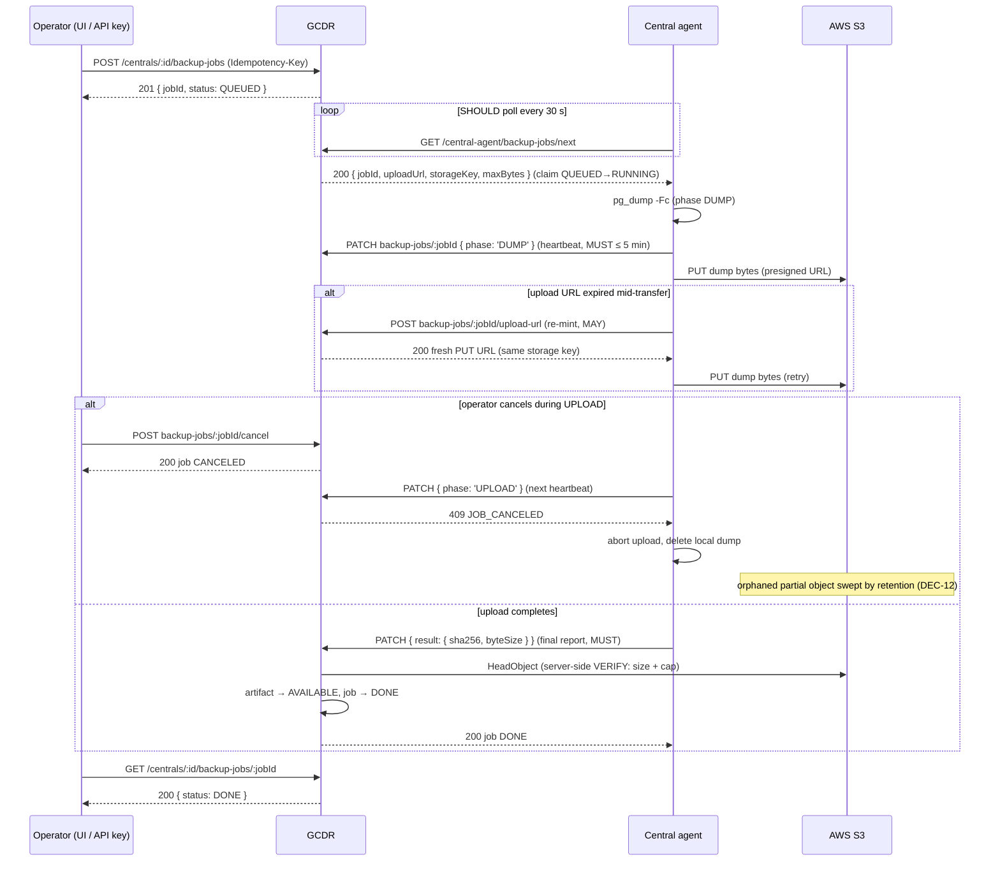

# RFC-0063: Central Backup & Restore Jobs (AWS S3)

- Feature Name: `central_backup_restore_jobs`
- Start Date: 2026-08-31
- RFC PR: (leave this empty)
- Tracking Issue: (leave this empty)
- Status: **Draft v3 — BMAD roundtable fixes applied**
- Related package: `packages/backend` (GCDR)
- Primary files (new/changed): `src/services/CentralBackupService.ts` (extend),
  `src/services/CentralBackupJobService.ts` (new), `src/services/CentralRestoreService.ts`
  (extend — confirmation token), `src/services/CentralRestoreSweep.ts` (extend — backup-job
  + retention sweeps), `src/repositories/CentralBackupJobRepository.ts` (new),
  `src/controllers/centrals.controller.ts`, `src/controllers/central-agent.controller.ts`,
  `src/middleware/requireCentralOpsAccess.ts` (new — modeled on `requireCentralSyncAccess`),
  `src/middleware/rateLimit.ts` (new limiters), `drizzle/migrations/0068_central_backup_jobs.sql` (new)
- Builds on: **RFC-0030** (S3 storage abstraction, presigned URLs, `file_assets`),
  **RFC-0056** (central agent auth: enroll token → `agent_secret` JWT, poll loop),
  **RFC-0009** (audit logs), **RFC-0057** (split-verb RBAC lesson, authorization matrix
  format), **RFC-0061** (API conventions: `Idempotency-Key`, `confirmationToken`),
  existing tables `central_backups` (0051), `central_restore_jobs` (0052),
  `central_commands` (0055)

> **Changelog v2 (PR #53 review):** idempotency keys are now scoped per
> operation + central and carry a request hash — replaying a key with a
> different payload is `409` (R1); `sourceLabel` became a closed enum with a
> CHECK (R2); the read-only wording was fixed — metadata read *is* intentionally
> reachable by `policy:read-only`, download/restore never are (R3); new API-key
> scopes must land in BOTH the entity union and the DTO enum with a
> list-equality regression test (R4); the restore `confirmationToken` became a
> **single-use** persisted nonce — a stateless HMAC was replayable within its
> TTL after a fast failure/cancel (R5); audit events from the central/sweep
> record `user_id = NULL` with the origin in metadata, never `central:<uuid>`
> in a uuid column (R6).

> **Changelog v3 (BMAD roundtable):**
> - **W1–W5 (architecture):** upload cap cut to 4 GiB with multipart upload
>   specified as the prerequisite to raise it (DEC-13); idempotent re-claim of
>   a RUNNING job whose claim response was lost (DEC-5); duplicate
>   `central_restore_jobs_idempotency_unique` index removed from the migration;
>   legacy-flow removal replaced by a measurable gate — usage counter +
>   kill-switch (DEC-4); retention floor: never delete a central's last
>   `AVAILABLE` backup (DEC-12).
> - **A1–A5 (adversarial/dev):** migration dedup (with W3); agent heartbeat
>   MUST (≤ 5 min) + PATCH error taxonomy and typed DTOs; `request_hash`
>   canonicalization and same-key race resolution without 500s (DEC-8);
>   S3-delete-before-`deleted_at` ordering + Standard-IA lifecycle cost note
>   (DEC-12).
> - **M1–M5 (business):** *Field replacement (hardware swap)* section with an
>   explicit field-team assumption to validate; agent rollout promoted to Q1
>   (GA blocker); *Success metrics (v1)* subsection + quarterly restore
>   rehearsal; *Data protection* section (LGPD deletion path, 10-min download
>   TTL, download alerting, SSE-KMS as GA prerequisite); mandatory `reason` on
>   restore.
> - **P1–P5 (doc-as-contract):** audit table repaired (orphan row) with the
>   actor contract promoted to its own subsection; glossary; RFC 2119 keywords
>   applied to agent-contract phrases; consolidated state-transition table;
>   end-to-end sequence diagram + JSON examples for the agent endpoints;
>   normative 30 s poll cadence.

The key words **MUST**, **MUST NOT**, **REQUIRED**, **SHALL**, **SHALL NOT**,
**SHOULD**, **SHOULD NOT**, **RECOMMENDED**, **MAY**, and **OPTIONAL** in this
document are to be interpreted as described in
[RFC 2119](https://www.rfc-editor.org/rfc/rfc2119).

---

## Summary

Promote the existing central backup/restore brokerage into a first-class,
operator-driven **job system**: an authenticated + RBAC-gated request creates a
**backup job** for a specific central; the central's `myio-gcdr-agent` claims it
over the existing poll loop, runs `pg_dump` locally, uploads the dump straight to
**AWS S3** via a presigned URL, and reports progress back. Restore keeps the
existing job machinery and gains destructive-action guard rails
(`confirmationToken`, integrity gate, cancel semantics). The RFC also closes the
transversal gaps of the current implementation: split-verb RBAC with customer
hierarchy binding, pagination + period filters on every listing, rate limits and
concurrency guards on job creation, idempotent creation, retention/expiry with an
S3 cleanup sweep, and complete RFC-0009 auditing.

GCDR remains a **broker**: it never runs `pg_dump`/`pg_restore` and the dump
bytes never transit through it. That boundary — established by migrations
0051/0052 and `CentralBackupService` — is preserved unchanged.

### Glossary

- **Central** — the on-site controller box (called "gateway" in some older
  docs; this RFC uses *central* throughout) running embedded
  Postgres/TimescaleDB.
- **Agent** — the `myio-gcdr-agent` process on the central; polls GCDR and runs
  dump/upload/restore locally (RFC-0056 auth).
- **Job** — the orchestration record (`central_backup_jobs` /
  `central_restore_jobs`): who asked, claim, phases, terminal status.
- **Artifact** — the produced backup: a `central_backups` row + its S3 object.
- **Legacy slot flow** — the pre-RFC operator-facing presigned-PUT endpoints
  (`POST /centrals/:id/backup` + confirm), deprecated by DEC-4.
- **Phase vs status** — *status* is the job lifecycle (QUEUED…EXPIRED); *phase*
  is the agent's position inside a RUNNING job. Note: `QUEUED` exists in
  **both** enums with distinct semantics (status = "not yet claimed"; phase =
  "no work started yet").

## Motivation

The building blocks already exist (see *Prior art*), but the current surface has
operational and security gaps:

1. **No server→central dispatch for backups.** `POST /centrals/:id/backup` mints
   a presigned PUT URL and hands it **to the caller** — but nothing tells the
   central to run `pg_dump`. Today a backup only happens if the central itself
   (or an operator SSH'd into it) drives the flow. An operator in the GCDR UI
   cannot say "back up this central now" and watch it happen. Restore and
   commands already have exactly the dispatch mechanism we need (agent poll +
   claim + progress report); backup is the odd one out.
2. **The browser receives an upload capability.** The presigned PUT URL returned
   to the operator is a bearer credential to write into the tenant's backup
   prefix. Restore deliberately avoids this (`F-B3`: the download URL is only
   handed to the authenticated central via `jobs/next`, never to the browser).
   Backup should honor the same boundary.
3. **Coarse RBAC.** The whole `/centrals` router sits behind
   `hybridAuthByMethod(centrals:read, centrals:write)`. Any principal with
   `centrals:write` — e.g. a key meant to rename centrals — can start a
   **restore**, the single most destructive operation we can inflict on a
   production box. RFC-0057's P0.3 review found the same shape
   (`*.*.read` reaching secret reveal) and fixed it by splitting verbs into
   dedicated high-risk permissions; the same lesson applies here, harder.
4. **No hierarchy binding.** Queries are tenant-scoped, but a SUBTREE/SELF API
   key of customer A can operate on customer B's centrals within the same
   tenant. RFC-0056's PR #32 introduced `requireCentralSyncAccess` for exactly
   this; backup/restore needs the same guard.
5. **No cancel for backups, no tenant-wide listings, no period filters.**
   Operators asked for: list jobs in a period (from/to) across the fleet, list
   jobs of one central, cancel a job.
6. **No retention.** Backups accumulate in S3 forever; `EXPIRED` exists in the
   0051 enum but nothing ever sets it, and nothing deletes the S3 object.
7. **No rate limit / idempotency on job creation.** A stuck frontend retry loop
   can enqueue work or orphan PENDING rows; double-click creates double jobs
   (restore has a partial-unique backstop; backup slots have nothing).

## Guide-level explanation

### Backing up a central (operator view)

```
POST /api/v1/centrals/e982edf9-.../backup-jobs
Idempotency-Key: 0d9f...c2
{ "sourceLabel": "PRE_FIRMWARE_UPGRADE" }

→ 201 { "jobId": "...", "status": "QUEUED", "requestedPhase": "DUMP" }
```

The job is now QUEUED. The central's agent — the same agent that already polls
`GET /central-agent/jobs/next` (restore) and `GET /central-agent/commands/next` —
also polls `GET /central-agent/backup-jobs/next`. Claiming the job atomically
flips it QUEUED → RUNNING and returns the presigned S3 PUT URL (1 h TTL,
re-mintable). The agent then:

1. `pg_dump -Fc` on its embedded Postgres/TimescaleDB (phase `DUMP`)
2. uploads the dump to the presigned URL (phase `UPLOAD`)
3. reports `sha256` + `byteSize`; GCDR `HeadObject`s the key, cross-checks the
   size, flips the linked `central_backups` row to `AVAILABLE`, and the job to
   `DONE` (phase `VERIFY` → `DONE`)

The operator watches progress with `GET /centrals/:id/backup-jobs/:jobId` and can
cancel a QUEUED/RUNNING job. A job whose central never claims it (offline box)
is swept to `EXPIRED`; a job whose central died mid-flight is swept to `FAILED`
— both by the same sweeper that already reaps restore jobs and commands.

The **artifact** (the `central_backups` row + S3 object) and the **job** (the
orchestration record) are separate resources: the job produces the artifact.
Listing backups of a central, fetching backup metadata, and minting an audited
download URL all operate on the artifact, exactly as today.

### Restoring a central (operator view)

Restore keeps the existing flow (job QUEUED → agent claims via `jobs/next` with
a presigned GET → phases DOWNLOAD → VERIFY → STOP_SERVICES → RESTORE_DB →
START_SERVICES → DONE), with three new guard rails:

1. **Server-side confirmation.** `POST /centrals/:id/restore` without a
   `confirmationToken` returns `428 CONFIRMATION_REQUIRED` plus a short-lived
   token bound to (central, backup). Replaying the request with the token
   actually enqueues the job. The frontend "type the central name" ritual is an
   extra layer, not the enforcement (RFC-0061 precedent).
2. **Integrity gate.** Only an `AVAILABLE` backup **with a recorded `sha256`**
   is restorable; the agent re-verifies the digest in its VERIFY phase and must
   fail the job on mismatch. (Size was already cross-checked at confirm time.)
3. **At most one active restore per central** — already enforced by the 0052
   partial-unique index; now surfaced as a documented `409`.

### Who may do what

Backup **read**, backup **create/cancel**, backup **download**, and **restore**
are four different permissions. Read never reaches create; create never reaches
download (a dump is the customer's entire database — download is a reveal-class
verb); nothing short of the dedicated restore permission reaches restore. Every
route additionally binds the target central's **customer** to the caller's
hierarchy (SELF/SUBTREE/TENANT for API keys; RBAC `resourceScope` for JWTs) —
out-of-reach centrals answer `404`, never `403`, to avoid existence leaks.

## Reference-level explanation

### Architecture (unchanged boundary)

```
Operator (JWT / API key)                     Central (agent_secret JWT)
   │                                              │
   │ POST /centrals/:id/backup-jobs               │ GET  /central-agent/backup-jobs/next
   ▼                                              │      (claim: QUEUED→RUNNING, presigned PUT)
 GCDR ──────────── central_backup_jobs ───────────┤ PATCH /central-agent/backup-jobs/:jobId
   │               central_backups                │      (phases; final: sha256+byteSize)
   │ presign PUT/GET (S3Storage, RFC-0030)        │
   ▼                                              ▼
 AWS S3  ◄────────────── dump bytes (PUT) ───── central runs pg_dump/pg_restore
```

GCDR touches S3 only for `HeadObject` (verify), `DeleteObject` (retention), and
presigning. Dump bytes never enter the GCDR process.

#### End-to-end sequence (happy path, re-mint, mid-upload cancel)



### Decisions

**DEC-1 — New `central_backup_jobs` table; `central_backups` stays the artifact
registry.** The 0051 table conflates a *slot* (PENDING) with an *artifact*
(AVAILABLE), but has no claim/cancel/stall semantics. Rather than overloading it
with job states, we add a jobs table mirroring the proven shape of
`central_restore_jobs` (0052) and `central_commands` (0055): claim by poll,
partial-unique one-active-per-central index, `(status, updated_at)` sweep index,
CAS-guarded progress updates. The job holds a nullable FK to the
`central_backups` row it produces (created at claim time, when the storage key
is minted). *Rejected:* extending `central_backups` with job columns — mixes
orchestration with artifact lifecycle, and the artifact row must outlive the job
(retention, restore FK). *Rejected:* a `BACKUP` `central_command_type` — commands
carry no storage key, no artifact linkage, no phases, and their 5-minute stall
timeout is wrong for a multi-GB dump.

**DEC-2 — Job state vocabulary reuses the house enums.** Requested lifecycle
(PENDING → DISPATCHED → RUNNING → COMPLETED | FAILED | CANCELLED | EXPIRED) maps
onto the existing vocabulary as `QUEUED → RUNNING → DONE | FAILED | CANCELED |
EXPIRED`, with `claimed_at` recording the dispatch moment (as in 0055). We do
not introduce a distinct `DISPATCHED` state: claim and start are one atomic
transition in the poll model (the agent that claims *is* the agent that runs),
so a separate state would be a row nothing ever observes. `EXPIRED` is new to
the jobs vocabulary: a QUEUED job never claimed within `BACKUP_JOB_CLAIM_TTL`
(default 24 h — central offline) is swept to `EXPIRED`, distinguishing "the box
never heard about it" from "the box tried and died" (`FAILED`).

**DEC-3 — Phases: `QUEUED → DUMP → UPLOAD → VERIFY → DONE`,** forward-only with
the same no-regress CAS validation as `CentralRestoreService.updateProgress`
(CR-S6). `VERIFY` is server-side: on the agent's final report (sha256 +
byteSize) GCDR `HeadObject`s the key and cross-checks size before flipping the
artifact to `AVAILABLE` and the job to `DONE` — reusing the CR-S4 logic already
in `CentralBackupService.confirmBackup`.

**DEC-4 — The presigned PUT URL is only ever handed to the authenticated
central** (claim response + a re-mint action for TTL overruns, reusing CR-S9's
same-key/no-new-row rule). The operator-facing job creation returns **no URL**.
This closes gap #2 by extending the restore-side F-B3 boundary to backups.
The legacy operator-facing slot endpoints (`POST /centrals/:id/backup`,
`.../backups/:backupId/confirm`, `.../upload-url`) are **deprecated** (some
centrals may self-initiate scheduled local backups against them with their
`CENTRAL_API_KEY`). Removal is gated on measurables, not a release count:
(a) a per-central **usage counter** for the legacy endpoints (structured log +
derived metric) MUST ship with this RFC, so we know who still calls them;
(b) an env **kill-switch** (`CENTRAL_LEGACY_BACKUP_FLOW_ENABLED=false`) MUST
allow turning the legacy flow off without a deploy;
(c) actual removal happens only when **scheduling is delivered OR the legacy
flow shows zero usage for 30 consecutive days — whichever comes last**.
*Rejected:* keeping both flows indefinitely — two write paths into the same
artifact table is how state machines rot. *Rejected (v2 → v3):* "kept one
release, then removed" — with no usage signal that was a guess wearing a
deadline.

**DEC-5 — Separate agent routes, not a unified "next work item".**
`GET /central-agent/backup-jobs/next` + `PATCH /central-agent/backup-jobs/:jobId`
mirror the restore/command pairs. The agent SHOULD poll every **30 s**
(normative cadence, replacing the earlier "~2 req/min" estimate) — well within
`centralPollRateLimiter`'s 60/min budget even with the extra route. *Rejected:*
changing `jobs/next` to return a `kind`-discriminated union — it breaks every
deployed agent.

**Idempotent re-claim (lost claim response).** On flaky 4G the claim response
can be lost *after* the QUEUED→RUNNING flip commits. Therefore
`GET /central-agent/backup-jobs/next` MUST re-deliver the central's own
RUNNING job — same `jobId`, presigned PUT URL re-minted (CR-S9 semantics) —
when `current_phase IN ('QUEUED', 'DUMP')` and no progress report has been
received yet. A lost response is not a second claim; the retrying agent
converges on the same job instead of finding an empty queue plus a job that can
only ever stall to FAILED.

**Heartbeat.** During `DUMP` and `UPLOAD` the agent MUST send a progress PATCH
at least every **5 minutes**, even without a phase change (a `logEntry`-only
PATCH suffices). The heartbeat is what refreshes `updated_at` — the 30-minute
stall sweep reaps on `updated_at`, and a legitimate multi-GB upload without
heartbeats would be indistinguishable from a dead central.

**DEC-6 — Split-verb RBAC (RFC-0057 P0.3 lesson), four permissions:**

| Permission (RBAC dotted) | API-key scope | Verbs it gates |
|---|---|---|
| `centrals.backup.read` | `central-backups:read` | list/get jobs, list/get backups (metadata only) |
| `centrals.backup.write` | `central-backups:write` | create backup job, cancel backup job, delete backup |
| `centrals.backup.download` | `central-backups:download` | mint download URL (reveal-class: the dump is the customer's whole DB) |
| `centrals.restore.execute` | `central-restore:execute` | create restore job, cancel restore job |

`centrals.backup.read` **is** matched by `policy:read-only`’s `*.*.read` —
**intentionally**: job/backup *metadata* contains no secrets and belongs in a
viewer’s read surface (the authorization matrix reflects this). What read-only
can **never** reach are the non-read verbs: `write`, `download` and
`restore.execute` — that is the whole point of the verb split. `download` and `restore.execute` are granted by a new high-risk seed
policy `policy:central-ops-critical` attached to `role:super-admin` and
`role:central-admin` only — never bundled into a wildcard write policy.
**Implementation requirement (known drift):** the new API-key scopes MUST be
added in **both** `src/domain/entities/CustomerApiKey.ts` (`ApiKeyScope` union)
and `src/dto/request/CustomerApiKeyDTO.ts` (the validation enum) — the two
lists have drifted before, leaving scopes that exist in the domain but fail DTO
validation. A regression test MUST assert list equality between them.

*Rejected:* riding on `centrals:write` (gap #3); *rejected:* a single
`central-backups:manage` scope — a dashboard that shows backup history must not
be able to exfiltrate dumps.

**DEC-7 — Hierarchy binding via `requireCentralOpsAccess`, modeled 1:1 on
`requireCentralSyncAccess` (RFC-0056 PR #32).** The guard resolves
`central.customerId` from `:id` (the routes are central-addressed, not
customer-addressed), then applies the identical ladder: master key `*` bypass;
API key TENANT → any customer, SELF → key's own customer, SUBTREE → key's
customer or descendants, out of reach → **404** (no existence leak); JWT → RBAC
`evaluatePermission` with `resourceScope: customer:<id>`, deny → **403** (session
stays valid). A nonexistent central is also `404`, indistinguishable from
out-of-reach — deliberate.

**DEC-8 — Idempotent creation (operation- and central-scoped).**
`POST .../backup-jobs` and `POST .../restore` accept an `Idempotency-Key`
header (RFC-0061 precedent). The key is stored on the job row together with a
**`request_hash`** (sha256 of the canonicalized request body), and uniqueness
is **per tenant + central** (the operation is already separated by table:
backup jobs vs restore jobs). Replay semantics:

- same key, same central, same `request_hash` → `200` with the original job;
- same key with a **different central or different body** →
  `409 IDEMPOTENCY_KEY_REUSE` (never silently returns someone else’s job);
- absent key: optional for backup jobs (the one-active guard bounds the
  damage), **required** for restore (`400 IDEMPOTENCY_KEY_MISSING`) — a
  duplicated restore is double downtime.

**Canonicalization:** `request_hash` = sha256 of the request body **after Zod
parsing** (defaults applied, unknown keys stripped), serialized as JSON with
keys sorted lexicographically at every level — so `{}` and an explicit
`{ "sourceLabel": "MANUAL" }` hash identically. **Same-key race:** two
concurrent creates with the same key both pass the pre-check; the loser hits
`23505` on the idempotency index. That violation is caught (unwrapped from
`DrizzleQueryError.cause`), the winning row is re-fetched, and its
`request_hash` compared: equal → `200` with the winner's job; different →
`409 IDEMPOTENCY_KEY_REUSE`. Never a `500`.

*Rejected:* uniqueness on `(tenant_id, key)` alone — a stuck client reusing a
key across centrals would be handed an unrelated job, which for backup/restore
is a correctness bug, not a convenience.

**DEC-9 — Restore confirmation is a server-side, single-use nonce.** Without a
valid `confirmationToken`, `POST /centrals/:id/restore` answers
`428 CONFIRMATION_REQUIRED` with `{ confirmationToken, expiresIn: 300 }`. The
token is a random 256-bit value whose sha256 lands in
`central_restore_confirmations` (tenant, central, **specific backup**, issuer,
5-minute TTL). The retry carrying the token enqueues the job only if the row is
**consumed atomically** (`UPDATE … SET consumed_at = now() WHERE token_hash = …
AND consumed_at IS NULL AND expires_at > now()` returning a row) — a token is
good for exactly one restore attempt, ever. Binding to the specific backup
means a UI race that swaps the selected backup invalidates the confirmation;
expired/consumed rows are purged by the retention sweep.
*Rejected:* frontend-only "type DELETE" ritual (bypassed by any API caller);
*rejected (v1 → v2):* a **stateless HMAC** token — within its TTL it was
replayable after a fast failure/cancel (the one-active index only prevents
*stacking*, not sequential replays), and for the most destructive operation in
the system a one-row table is a fair price for at-most-once semantics.

**Mandatory restore `reason` (v3).** `POST /centrals/:id/restore` MUST carry a
`reason` field — enum `HARDWARE_SWAP | DISASTER_RECOVERY | ROLLBACK | OTHER` —
plus `reasonNote` (free text), **required when `reason = 'OTHER'`**.
Missing/invalid → `400`. The value is persisted on the restore job row
(migration below) and recorded in the restore audit event metadata: the most
destructive operation in the system must never leave "why" to archaeology.

**DEC-10 — Integrity gate for restore.** A backup is restorable only when
`status = 'AVAILABLE' AND sha256 IS NOT NULL` (400 otherwise). The claim
response already ships `sha256` + `byteSize`; the agent MUST verify the digest
during its `VERIFY` phase and report `FAILED` on mismatch — GCDR cannot verify
sha256 server-side (S3 multipart ETag ≠ sha256, CR-S4), so the split stays:
size authoritative at GCDR, digest authoritative at the central.

**DEC-11 — Concurrency + rate limits.**
- One active (QUEUED/RUNNING) backup job per central — app-level pre-check for a
  friendly `409 BACKUP_JOB_ACTIVE`, partial-unique index as the race-proof
  backstop (exact mirror of 0052/0055).
- `centralBackupJobRateLimiter` (`rateLimit('central-backup-job', ...)`):
  **4 creations / hour** keyed `central:<id>` — a dump is heavy on the box; plus
  **20 / hour** keyed by principal (API key id or user id) across centrals.
- `centralBackupDownloadRateLimiter`: **30 URL mints / hour** per principal —
  each mint is an exfiltration-capable bearer URL.
- Restore creation: **2 / hour** per central (`central-restore-create`).
- Known limitation carried over from CR-S7: the limiter is per-process; numbers
  above are per-replica until the Postgres fixed-window follow-up lands.

**DEC-12 — Retention & cleanup.** Policy (env-tunable, applied per central).
The delete predicate, explicitly: a backup is expirable when
`rank_per_central > BACKUP_RETENTION_KEEP_LAST OR created_at < now() -
BACKUP_RETENTION_MAX_AGE_DAYS` (rank = row number ordered by `created_at DESC`
within the central; defaults **7** / **90 days**), and it is not referenced by
a non-terminal restore job. **Floor:** the sweep MUST NOT delete the most
recent `AVAILABLE` backup of a central — even one past `MAX_AGE_DAYS` — so a
central that has sat offline for months still keeps exactly one restorable
backup. **Delete ordering:** the sweep first marks the row `EXPIRED`; S3
`DeleteObject` runs next, and `deleted_at` is set **only after S3 confirms the
deletion**. Rows in `EXPIRED AND deleted_at IS NULL` are retried every tick —
no orphan objects silently paying storage. Each deletion is audited. The
retention sweep MUST run hourly (same scheduler family as
`CentralRestoreSweep`). `PENDING` artifact rows older than 24 h (upload never
confirmed) → `EXPIRED`, object deleted if present. Manual
`DELETE /centrals/:id/backups/:backupId` requires `centrals.backup.write` +
`confirmationToken` (destructive, RFC-0061). S3 lifecycle rules on the
`backups/` prefix act as a belt-and-suspenders backstop at `MAX_AGE_DAYS + 30`.
**Cost note:** a lifecycle rule transitions objects S3 Standard →
Standard-IA after 7 days — presigned GET works identically on IA, and most
downloads happen within days of creation. Glacier tiers are *rejected*:
retrieval latency at the exact moment an operator needs a restore is the wrong
trade. *Rejected:* relying on S3 lifecycle alone — GCDR rows would dangle and
restore would 404 at DOWNLOAD, the worst possible moment.

**DEC-13 — Size cap.** `CENTRAL_BACKUP_MAX_BYTES` (default **4 GiB** — not 10:
a single presigned PUT has a hard **5 GiB** S3 object-size limit, so any cap
above what the transport can carry would be a lie). A presigned **PUT** cannot
enforce `content-length-range` (that is a POST-policy feature), so enforcement
stays at verify time: `HeadObject.byteSize` over the cap → job `FAILED`,
artifact `FAILED`, object deleted. Honest limitation: an abusive agent can
still land an oversized object for the minutes until verification; the
per-central rate limit bounds the blast radius.
Dumps that may exceed 4 GiB (Moxuara's TimescaleDB is the known worst case)
require **multipart upload**, specified here as the prerequisite for raising
the cap: GCDR performs `CreateMultipartUpload` at claim time; the agent obtains
per-part presigned URLs via the CR-S9-style re-mint endpoint (part number as a
parameter); the server performs `CompleteMultipartUpload` as part of VERIFY;
per-part retry/resume also fixes 4G connection drops mid-upload. Tracked as a
prioritized unresolved question. *Rejected:* presigned POST policies — the
agent-side upload code and CR-S9 re-mint flow are built around PUT, and the
marginal win doesn't justify the churn.

**DEC-14 — S3 key layout stays `backups/{tenantId}/{centralId}/{backupId}.pgdump.custom`**
(established by 0051). `customerId` is deliberately absent: centrals can be
moved between customers, and the tenant+central pair is the stable physical
identity; customer scoping is enforced at the API layer (DEC-7), not the key
layout. Bucket: SSE-S3 from day one; **SSE-KMS is a GA prerequisite** (see
*Data protection*), block public access, no bucket-level listing granted to any
app principal.

**DEC-15 — Backups do NOT use `file_assets`.** `file_assets` (RFC-0030) is a
generic owner-typed store for user uploads with a scan pipeline and inline
byte handling; backups never transit GCDR, need central-specific lifecycle
(`AVAILABLE`/`EXPIRED`, restore FK, one-object-per-row unique key), and are
multi-GB. `central_backups` remains the dedicated registry. *Rejected:* a
`file_assets` row per backup — every column of its scan/owner model would be
dead weight, and its `status` vocabulary conflicts.

**DEC-16 — Cancel semantics.** Cancel is legal from `QUEUED` and `RUNNING`
only (`409 JOB_ALREADY_TERMINAL` otherwise), CAS-guarded so a concurrent
terminal transition (agent report, sweep) wins — the loser gets the CAS
rejection, mirroring `cancelRestore`. Cancel of a RUNNING backup job is
**advisory-best-effort**: the agent learns of it when its next progress PATCH is
rejected with `409 JOB_CANCELED` and aborts the dump/upload; any bytes already
in S3 are cleaned by the PENDING-artifact sweep. Backup cancel is harmless;
restore cancel keeps its existing semantics (operator PATCH is cancel-only —
round-3 #10 — and a cancel that lands after `RESTORE_DB` began does not undo the
restore; the job ends `CANCELED` and the central converges by finishing or
failing its local script).

**DEC-17 — No in-place retry endpoint.** A failed job is immutable history;
"retry" = create a new job (idempotency makes that safe, the one-active index
makes it orderly). *Rejected:* `POST .../retry` reviving a FAILED row — it
destroys the audit trail of how many attempts were needed and complicates the
partial-unique index.

**DEC-18 — Tenant-wide listings live at `/central-backup-jobs` and
`/central-backups` (top-level).** Nesting them as `/centrals/backup-jobs` would
shadow-fight the `/centrals/:id` param route (order-dependent matching), and
these are fleet-ops views, not single-central views. Both support
`from`/`to`/`status`/`centralId`/`customerId` filters with house pagination.
API keys see them through the same hierarchy filter (SELF/SUBTREE keys get rows
for reachable customers only).

### Data model

New migration `0068_central_backup_jobs.sql` (custom runner, no BEGIN/COMMIT):

```sql
CREATE TYPE "central_backup_job_status" AS ENUM
  ('QUEUED', 'RUNNING', 'DONE', 'FAILED', 'CANCELED', 'EXPIRED');
CREATE TYPE "central_backup_job_phase" AS ENUM
  ('QUEUED', 'DUMP', 'UPLOAD', 'VERIFY', 'DONE');

CREATE TABLE "central_backup_jobs" (
  "id"              uuid PRIMARY KEY DEFAULT gen_random_uuid(),
  "tenant_id"       uuid NOT NULL,
  "central_id"      uuid NOT NULL REFERENCES "centrals"("id"),
  "backup_id"       uuid REFERENCES "central_backups"("id"), -- set at claim
  "status"          "central_backup_job_status" NOT NULL DEFAULT 'QUEUED',
  "current_phase"   "central_backup_job_phase"  NOT NULL DEFAULT 'QUEUED',
  "source_label"    varchar(32) NOT NULL DEFAULT 'MANUAL'
    CHECK ("source_label" IN ('MANUAL','SCHEDULED','PRE_RESTORE','PRE_FIRMWARE_UPGRADE')),
  "idempotency_key" varchar(255),
  "request_hash"    char(64),          -- sha256 of the canonical request body (DEC-8)
  "log_entries"     jsonb NOT NULL DEFAULT '[]',
  "error_message"   text,
  "created_at"      timestamptz NOT NULL DEFAULT now(),
  "updated_at"      timestamptz NOT NULL DEFAULT now(),
  "claimed_at"      timestamptz,
  "completed_at"    timestamptz,
  "created_by"      uuid
);

CREATE INDEX "central_backup_jobs_tenant_central_idx"
  ON "central_backup_jobs" ("tenant_id", "central_id", "created_at" DESC);
CREATE INDEX "central_backup_jobs_tenant_created_idx"      -- period listings
  ON "central_backup_jobs" ("tenant_id", "created_at" DESC);
CREATE INDEX "central_backup_jobs_status_updated_idx"      -- sweeps
  ON "central_backup_jobs" ("status", "updated_at");
CREATE UNIQUE INDEX "central_backup_jobs_one_active_per_central"
  ON "central_backup_jobs" ("central_id") WHERE "status" IN ('QUEUED', 'RUNNING');
CREATE UNIQUE INDEX "central_backup_jobs_idempotency_unique"
  ON "central_backup_jobs" ("tenant_id", "central_id", "idempotency_key")
  WHERE "idempotency_key" IS NOT NULL;

-- Restore jobs gain the same idempotency columns (DEC-8):
ALTER TABLE "central_restore_jobs" ADD COLUMN "idempotency_key" varchar(255);
ALTER TABLE "central_restore_jobs" ADD COLUMN "request_hash" char(64);
CREATE UNIQUE INDEX "central_restore_jobs_idempotency_unique"
  ON "central_restore_jobs" ("tenant_id", "central_id", "idempotency_key")
  WHERE "idempotency_key" IS NOT NULL;

-- Mandatory restore reason (DEC-9, v3). Nullable at the column level for
-- pre-existing rows; the API layer requires it on every new restore.
ALTER TABLE "central_restore_jobs" ADD COLUMN "reason" varchar(32)
  CHECK ("reason" IN ('HARDWARE_SWAP','DISASTER_RECOVERY','ROLLBACK','OTHER'));
ALTER TABLE "central_restore_jobs" ADD COLUMN "reason_note" text;

-- One-time restore confirmations (DEC-9): consumed atomically at execute.
CREATE TABLE "central_restore_confirmations" (
  "id"          uuid PRIMARY KEY DEFAULT gen_random_uuid(),
  "tenant_id"   uuid NOT NULL,
  "central_id"  uuid NOT NULL REFERENCES "centrals"("id"),
  "backup_id"   uuid NOT NULL REFERENCES "central_backups"("id"),
  "token_hash"  char(64) NOT NULL,       -- sha256 of the handed-out token
  "issued_to"   uuid,                    -- operator user id (audit trail)
  "expires_at"  timestamptz NOT NULL,
  "consumed_at" timestamptz,
  "created_at"  timestamptz NOT NULL DEFAULT now()
);
CREATE INDEX "central_restore_confirmations_lookup_idx"
  ON "central_restore_confirmations" ("tenant_id", "token_hash");

-- Retention bookkeeping on the artifact (DEC-12):
ALTER TABLE "central_backups" ADD COLUMN "expires_at" timestamptz;
ALTER TABLE "central_backups" ADD COLUMN "deleted_at" timestamptz;
CREATE INDEX "central_backups_retention_idx"
  ON "central_backups" ("status", "created_at") WHERE "deleted_at" IS NULL;
```

No changes to `central_backups`' status enum: `EXPIRED` and `FAILED` already
exist there (0051) — this RFC finally puts them to work.

### Backup job state transitions (consolidated)

Consolidates DEC-2, DEC-16 and the sweeps into one contract table:

| From | To | Trigger | Who may cause it |
|---|---|---|---|
| — | QUEUED | `POST /centrals/:id/backup-jobs` | operator (`centrals.backup.write`) |
| QUEUED | RUNNING | atomic claim via `backup-jobs/next` | central agent |
| QUEUED | CANCELED | `POST .../backup-jobs/:jobId/cancel` | operator (`centrals.backup.write`) |
| QUEUED | EXPIRED | unclaimed past `BACKUP_JOB_CLAIM_TTL` (24 h) | sweep |
| RUNNING | DONE | final report + server-side VERIFY passes | agent report → server |
| RUNNING | FAILED | agent `error` report; VERIFY size/cap mismatch; stalled > `BACKUP_STALL_TIMEOUT_MS` | agent / server / sweep |
| RUNNING | CANCELED | cancel endpoint (advisory — agent learns via `409 JOB_CANCELED` on its next PATCH) | operator |
| DONE / FAILED / CANCELED / EXPIRED | — | terminal; no exits (DEC-17: retry = new job) | — |

All transitions are CAS-guarded (DEC-3, DEC-16): when two writers race, exactly
one wins and the loser receives the CAS rejection.

### API surface

Operator-facing (all under `hybridAuthByMethod` + `requireCentralOpsAccess`;
errors: house `AppError` envelope; all listings paginated
`page/pageSize/total/totalPages` with `pageSize` ≤ 200):

| Method & path | Scope / permission | Success | Notable errors |
|---|---|---|---|
| `POST /centrals/:id/backup-jobs` | `centrals.backup.write` | 201 job (200 on idempotent replay) | 404 central/out-of-reach; 409 `BACKUP_JOB_ACTIVE`; 429 |
| `GET /centrals/:id/backup-jobs?status&from&to` | `centrals.backup.read` | 200 page | 404 |
| `GET /centrals/:id/backup-jobs/:jobId` | `centrals.backup.read` | 200 job (+log entries) | 404 |
| `POST /centrals/:id/backup-jobs/:jobId/cancel` | `centrals.backup.write` | 200 job | 404; 409 `JOB_ALREADY_TERMINAL` / CAS conflict |
| `GET /central-backup-jobs?from&to&status&centralId&customerId` | `centrals.backup.read` | 200 page (hierarchy-filtered) | — |
| `GET /centrals/:id/backups?status&from&to` | `centrals.backup.read` | 200 page | 404 |
| `GET /centrals/:id/backups/:backupId` | `centrals.backup.read` | 200 metadata | 404 |
| `GET /central-backups?from&to&status&centralId&customerId` | `centrals.backup.read` | 200 page (hierarchy-filtered) | — |
| `GET /centrals/:id/backups/:backupId/download-url` | `centrals.backup.download` | 200 `{downloadUrl, sha256, byteSize, expiresIn}` | 404; 400 not AVAILABLE; 429 |
| `DELETE /centrals/:id/backups/:backupId` | `centrals.backup.write` | 204 | 404; 428 no token; 409 referenced by active restore |
| `POST /centrals/:id/restore` | `centrals.restore.execute` | 201 job | 404; 400 backup not restorable / no sha256 / no Idempotency-Key / missing `reason` (or `reasonNote` when OTHER); 428 no `confirmationToken`; 409 `RESTORE_ACTIVE`; 429 |
| `GET /centrals/:id/restore` / `.../:jobId` | `centrals.backup.read` | 200 | 404 |
| `PATCH /centrals/:id/restore/:jobId` (cancel-only, unchanged) | `centrals.restore.execute` | 200 | 400 non-cancel patch; 409 terminal/CAS |

Central-agent-facing (behind `centralAuthMiddleware` + existing poll limiters;
the central only ever sees its own rows):

| Method & path | Success | Notes |
|---|---|---|
| `GET /central-agent/backup-jobs/next` | 200 `{jobId, uploadUrl, storageKey, expiresIn, maxBytes}` / 204 | atomic claim QUEUED→RUNNING; creates the `central_backups` row (PENDING) + presigned PUT |
| `PATCH /central-agent/backup-jobs/:jobId` | 200 job | phases forward-only + CAS (DEC-3); final report carries `sha256`+`byteSize` → server VERIFY → artifact AVAILABLE, job DONE; `409 JOB_CANCELED` tells the agent to abort |
| `POST /central-agent/backup-jobs/:jobId/upload-url` | 200 re-minted PUT URL | CR-S9 semantics: same key, no new row, RUNNING only; the agent MAY re-mint on TTL overrun |
| `GET /central-agent/jobs/next` (restore) | unchanged | |
| `PATCH /central-agent/restore/:jobId` | unchanged | |

#### Agent PATCH contract (DTOs + error taxonomy)

The `PATCH /central-agent/backup-jobs/:jobId` body is a discriminated union
(Zod shapes):

```ts
// progress / heartbeat (DUMP and UPLOAD only — see below)
{ phase: 'DUMP' | 'UPLOAD', logEntry?: string }

// final report — MUST carry both fields
{ result: { sha256: string /* exactly 64 hex chars */, byteSize: number /* integer > 0 */ } }

// failure
{ error: { message: string } }
```

There is **no** `phase: 'VERIFY'` in the agent DTO: VERIFY is executed by the
**server** on receipt of the final report (`HeadObject` + size/cap cross-check),
which then sets VERIFY→DONE or FAILED. An agent sending `phase: 'VERIFY'`
receives `400`.

Error taxonomy for the agent PATCH:

| Response | Meaning | Agent behavior |
|---|---|---|
| `409 JOB_CANCELED` | operator canceled the job | abort dump/upload, delete the local dump file |
| `409 JOB_ALREADY_TERMINAL` | job reached DONE/FAILED/EXPIRED meanwhile | discard local state for this job |
| `400 PHASE_REGRESSION` | reported phase is behind `current_phase` | agent bug: log loudly and abort the job locally |

On cancel during `UPLOAD` the agent aborts the S3 PUT; the orphaned partial
object is swept by the PENDING-artifact retention pass (DEC-12) — the agent
needs no S3 delete rights.

#### Agent endpoint examples

`GET /central-agent/backup-jobs/next` — claim:

```json
// 200 (job claimed; 204 when there is no queued work)
{
  "jobId": "7c1f4e2a-9b31-4c8d-a2f0-5e6d7a8b9c0d",
  "uploadUrl": "https://gcdr-backups.s3.amazonaws.com/backups/...&X-Amz-Signature=...",
  "storageKey": "backups/11111111-.../e982edf9-.../7c1f4e2a-....pgdump.custom",
  "expiresIn": 3600,
  "maxBytes": 4294967296
}
```

`PATCH /central-agent/backup-jobs/:jobId` — heartbeat, then final report:

```json
// request (heartbeat during UPLOAD)
{ "phase": "UPLOAD", "logEntry": "uploaded 1.2 GiB of 3.1 GiB" }

// request (final report)
{ "result": { "sha256": "9f86d081884c7d659a2feaa0c55ad015a3bf4f1b2b0b822cd15d6c15b0f00a08", "byteSize": 3328599452 } }

// response 200 (after server-side VERIFY)
{ "jobId": "7c1f4e2a-9b31-4c8d-a2f0-5e6d7a8b9c0d", "status": "DONE", "currentPhase": "DONE" }
```

`POST /central-agent/backup-jobs/:jobId/upload-url` — re-mint:

```json
// 200
{ "uploadUrl": "https://gcdr-backups.s3.amazonaws.com/backups/...&X-Amz-Signature=...", "expiresIn": 3600 }
```

### Authorization matrix (RFC-0057 format)

| Principal | list/get jobs & backups | create/cancel backup job, delete backup | download URL | create/cancel restore |
|---|---|---|---|---|
| Master key / `DISABLE_AUTH` (`*`) | ✅ | ✅ | ✅ | ✅ |
| JWT `role:super-admin` | ✅ | ✅ | ✅ | ✅ |
| JWT `role:central-admin` (seed, gets `policy:central-ops-critical`) | ✅ (in scope) | ✅ (in scope) | ✅ (in scope) | ✅ (in scope) |
| JWT read-only / viewer (`*.*.read`) | ✅ (in scope) | ❌ 403 | ❌ 403 | ❌ 403 |
| API key `central-backups:read`, TENANT | ✅ tenant-wide | ❌ 403 (scope) | ❌ 403 | ❌ 403 |
| API key `central-backups:read`+`write`, SUBTREE | ✅/✅ subtree; others 404 | ✅ subtree; others 404 | ❌ 403 | ❌ 403 |
| API key `central-backups:download`, SELF | ✅ own customer | ❌ | ✅ own customer; others 404 | ❌ |
| API key `central-restore:execute`, SELF | needs `read` too | ❌ | ❌ | ✅ own customer; others 404 |
| Central agent JWT (`agent_secret`) | ❌ (agent routes only) | ❌ | ❌ (gets URLs only via claim) | ❌ |
| Legacy `centrals:write` key | unchanged for other central ops | ❌ on these routes | ❌ | ❌ |

Regression tests MUST assert the ❌ cells for read-only and for
`centrals:write`-only keys (the RFC-0057 P0.3 class of bug).

### Audit (RFC-0009)

New `EventType`s (existing `CENTRAL_BACKUP_INITIATED/CONFIRMED/DOWNLOADED` and
`CENTRAL_RESTORE_*` stay for the legacy flow and progress):

| Action | When | Actor |
|---|---|---|
| `CENTRAL_BACKUP_JOB_CREATED` | POST backup-jobs | operator |
| `CENTRAL_BACKUP_JOB_CANCELED` | cancel | operator |
| `CENTRAL_BACKUP_JOB_COMPLETED` / `_FAILED` / `_EXPIRED` | terminal transition | SYSTEM (see actor contract below) |
| `CENTRAL_BACKUP_DOWNLOADED` | download-url mint (existing, kept) | operator |
| `CENTRAL_BACKUP_DELETED` | manual delete or retention sweep (metadata: which) | operator / SYSTEM |
| `CENTRAL_RESTORE_CONFIRMATION_ISSUED` | 428 token handout | operator |
| `CENTRAL_RESTORE_CANCELED` | operator cancel | operator |

#### Actor contract (R6)

When the actor is the central agent or a sweep — not a human — the audit row
records **`user_id = NULL`** and the origin goes in `metadata`, e.g.
`{ "origin": "central", "centralId": "<uuid>" }` or
`{ "origin": "sweep", "sweep": "backup-retention" }`. Never encode
`central:<uuid>` (or any prefixed string) into a uuid-typed actor column — that
exact pattern has broken audit writes in this codebase before.

Outcome events follow the command-result precedent (audit the outcome, not just
the intent — see `central-agent.controller.ts` command PATCH).

### Observability

- Structured logs: `[backup-job]` create/claim/phase/terminal with jobId,
  centralId, phase, elapsed; `[backup-sweep]` / `[retention-sweep]` reap counts
  (mirroring `[restore-sweep]`).
- Counters (log-derived now, Prometheus later): jobs created / done / failed /
  canceled / expired; restore same; download URLs minted; retention deletions;
  bytes uploaded (from `byteSize`).
- Gauges: active backup/restore jobs (query on the partial index).
- Duration: `completed_at - claimed_at` per terminal job, logged.

### Sweeps (extends `CentralRestoreSweep`)

| Sweep | Condition | Action |
|---|---|---|
| Stalled backup job | RUNNING and `updated_at` older than `BACKUP_STALL_TIMEOUT_MS` (default 30 min — dump+upload of multi-GB over 4G) | → FAILED (never auto-retry; operator decision, same rationale as CR-S5) |
| Unclaimed backup job | QUEUED and `created_at` older than `BACKUP_JOB_CLAIM_TTL` (24 h) | → EXPIRED |
| Orphan artifact | `central_backups` PENDING > 24 h | → EXPIRED + S3 delete if object exists |
| Retention | per DEC-12 | artifact → EXPIRED, S3 delete, audit |

All isolated per-tick via `Promise.allSettled` like the existing sweeps; each
exported as a `-Once()` function for cron/serverless drive.

### Success metrics (v1)

The feature is working when, per tenant:

1. **Coverage:** ≥ **95%** of active centrals have an `AVAILABLE` backup newer
   than 7 days.
2. **Reliability:** job success rate `DONE / (DONE + FAILED + EXPIRED)` >
   **90%**.
3. **Latency:** median time from job creation to artifact `AVAILABLE`
   (tracked; no hard target in v1 — this release establishes the baseline).

Plus one process metric: a **quarterly restore rehearsal** on a reference
central (dry-run restore of its latest backup) — a backup that has never been
restored is a hypothesis, not a backup. The **"unprotected centrals" report**
(centrals with no `AVAILABLE` backup < 7 days — the feed for metric 1) is a
SHOULD for v1, promoted from *Future possibilities*: coverage you cannot see
is coverage you do not have.

## Field replacement (hardware swap)

The dominant real-world restore scenario is a dead or degraded box being
swapped in the field. The intended contract: **RFC-0056 re-enrollment binds
the replacement hardware to the *same logical central*** — per RFC-0005 the
`serialNumber` is the immutable logical identity (the `id` UUID and hardware
details track it). Under that model the new box polls as the same
`central_id`, so the existing **same-central restore** (0052's identity
binding) covers hardware swap with no cross-central machinery: swap the box,
re-enroll, restore the latest backup.

> **Assumption to validate with the field team before implementation:** does
> every deployment procedure actually re-enroll the replacement box as the
> same logical central? If any real procedure creates a **new** central row on
> swap (new serial → new row), the same-central binding makes every backup of
> the old row unreachable exactly when it is needed most — and **cross-central
> restore (Q3) is promoted to P0** for this feature to deliver its core value.

## Data protection

A backup is the customer's entire database; that deserves an explicit
section, not scattered footnotes.

- **LGPD / offboarding.** There MUST be a deletion path for *all* backups of a
  given customer: enumerate the customer's centrals
  (`centrals.customer_id`), then delete every `central_backups` row + S3
  object through the same audit-and-S3-first machinery as retention (DEC-12).
  v1 ships this as a documented **runbook** (SQL + sweep invocation); an admin
  endpoint (`DELETE /customers/:id/central-backups`) is OPTIONAL and may
  follow.
- **Download URL TTL.** The presigned **GET** (download) TTL is **10 minutes**
  — a download starts immediately or not at all. The presigned **PUT**
  (upload) keeps its 1 h TTL: a multi-GB upload over 4G legitimately needs it
  (and can re-mint).
- **Download alerting.** The audit stream (`CENTRAL_BACKUP_DOWNLOADED`) MUST
  feed an alert on more than N download-URL mints per day by a single
  principal (default N = 5, env-tunable) — bulk exfiltration of dumps looks
  exactly like this.
- **SSE-KMS is a GA prerequisite** (reclassified from "future hardening"):
  bucket-wide SSE-S3 is the day-one floor, but KMS key rotation is the only
  real remediation for a leaked-presigned-URL pattern; GA does not ship
  without it.

## Drawbacks

- **Two backup entry paths during the deprecation window** (legacy slot flow +
  jobs) — mitigated by both funneling into the same artifact rows and CR-S4
  verification, and by the measurable removal gate + kill-switch (DEC-4).
- **Agent firmware coupling**: the job flow only works once the fleet's
  `myio-gcdr-agent` ships the backup poll. Old agents simply never claim; jobs
  expire visibly (EXPIRED), which is at least honest.
- **Four new permissions** add RBAC surface to seed, document, and test.
- **Per-replica rate limits** (inherited CR-S7 debt) weaken DEC-11 numbers under
  horizontal scaling.
- Cancel of a RUNNING job is advisory (poll model has no push channel), so a
  canceled dump may still burn central CPU until the next report.

## Rationale and alternatives

- **Why a jobs table instead of a queue/broker (MQTT, SQS)?** The poll-claim
  pattern is already deployed and battle-tested twice (restore, commands); the
  fleet's connectivity model (NAT'd 4G, no inbound) rules out push, and adding a
  broker for ~2 msg/min/central is operational overkill.
- **Why not synchronous backup ("POST returns when done")?** Multi-GB dumps take
  tens of minutes; HTTP request lifetimes and LB idle timeouts make sync flows
  lie. Jobs + polling is the only honest shape.
- **Why S3 and not GCDR-local disk?** The EC2 host is memory- and disk-tight
  (see the OOM cutover); S3 gives durability, lifecycle backstops, and presigned
  transfer that bypasses GCDR entirely (RFC-0030 already paid the integration
  cost).
- **Why keep artifact and job separate** (vs. one table): the artifact outlives
  the job (retention, restore FK, download), and restore already FKs
  `central_backups` — merging would force restore to reference a "job" that
  might be a legacy slot. Separation also leaves the legacy flow working
  untouched during deprecation.

## Prior art (the existing infra this RFC builds on)

- `central_backups` (0051) + `CentralBackupService`: presigned-PUT slot flow,
  CR-S4 HeadObject size verification, CR-S9 URL re-mint, audited download URLs.
  **Kept as the artifact registry**; its operator-facing creation surface is
  deprecated (DEC-4).
- `central_restore_jobs` (0052) + `CentralRestoreService` + agent poll: the
  claim/progress/CAS/no-regress state machine, one-active partial index,
  operator-cancel-only PATCH. **Template for `central_backup_jobs`**; extended
  with `confirmationToken`, required idempotency, integrity gate.
- `central_commands` (0055): proves the poll-claim pattern generalizes; its
  REBOOT/RESTART types stay orthogonal to backup (DEC-1).
- `CentralRestoreSweep` (CR-S5): stall-reaping scheduler this RFC extends with
  three more sweeps.
- `S3Storage` (RFC-0030): presigning, HeadObject, DeleteObject — no changes
  needed beyond usage.
- `requireCentralSyncAccess` (RFC-0056 PR #32) and RFC-0057's split-verb fix:
  the two authorization patterns this RFC instantiates for central ops.
- `rateLimit.ts` (RFC-0032): named-bucket limiters + `consumeIfAllowed`.

## Unresolved questions

1. **Agent rollout sequencing (GA blocker — promoted from last place).** The
   job flow delivers zero value until the fleet's `myio-gcdr-agent` ships the
   backup poll: an old agent never claims, and every job an operator creates
   just dies `EXPIRED` 24 h later. This RFC MUST NOT be declared GA without a
   rollout plan carrying a measurable milestone — **% of the fleet on a
   backup-poll-capable agent version** — as the GA criterion; the plan also
   answers whether legacy-flow removal waits for full penetration or the DEC-4
   kill-switch suffices.
2. **Multipart upload for > 4 GiB dumps** (DEC-13, prioritized) — the
   `CreateMultipartUpload` / per-part re-mint / server-side
   `CompleteMultipartUpload` flow is sketched but not costed; it is the
   prerequisite for raising `CENTRAL_BACKUP_MAX_BYTES`, and Moxuara-class
   TimescaleDB dumps are the forcing function.
3. **Cross-central restore** (restore central B from central A's backup) — 0052
   binds backup and target to the same central id (field-swap identity model).
   Real demand exists for "clone a config to a new site"; needs its own RFC
   (identity, serials, MQTT credentials cannot be blindly restored) — and it
   becomes **P0** if the field-swap assumption fails validation (see *Field
   replacement*).
4. **Multi-replica rate limiting** — the Postgres fixed-window store (CR-S7
   follow-up) becomes more pressing once fleet-wide backup schedules exist.
5. **Exact retention defaults** (7 / 90 days / 4 GiB) are proposals pending
   ops sizing against real dump sizes (Moxuara's TimescaleDB is the reference
   worst case).
6. **Scheduled backups** — should GCDR own cron-like per-central schedules
   (e.g. nightly), or does the central's local cron keep initiating via its
   API key? Deliberately down-ranked (was Q1): the dominant job-to-be-done is
   the **on-demand backup before a risky operation** — the `sourceLabel` enum
   (`PRE_FIRMWARE_UPGRADE`, `PRE_RESTORE`) is the tell. The jobs API stays
   schedule-ready (a scheduler is just another creator principal).

## Future possibilities

- Backup **schedules** (per-central cron in GCDR) reusing this job surface.
- **Differential/WAL-based** backups once dump sizes hurt (pgBackRest on the
  central, same brokerage).
- **Restore rehearsal**: `dryRun` already exists on restore jobs; a periodic
  automated dry-run per central would turn backups from "probably fine" into
  "verified restorable".
- Frontend: a Backup & Restore tab on the central detail page (gcdr-frontend),
  driven entirely by this API.
- Prometheus metrics endpoint formalizing the counters in *Observability*.
- Extending `central-backup-jobs` tenant-wide listing with richer fleet KPIs
  (the "unprotected centrals" report itself moved into v1 as a SHOULD — see
  *Success metrics (v1)*).
